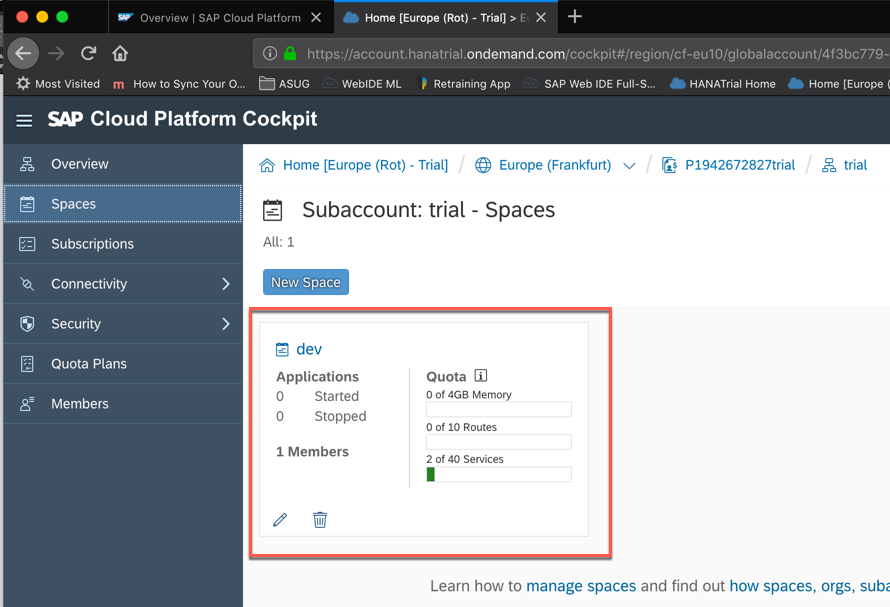
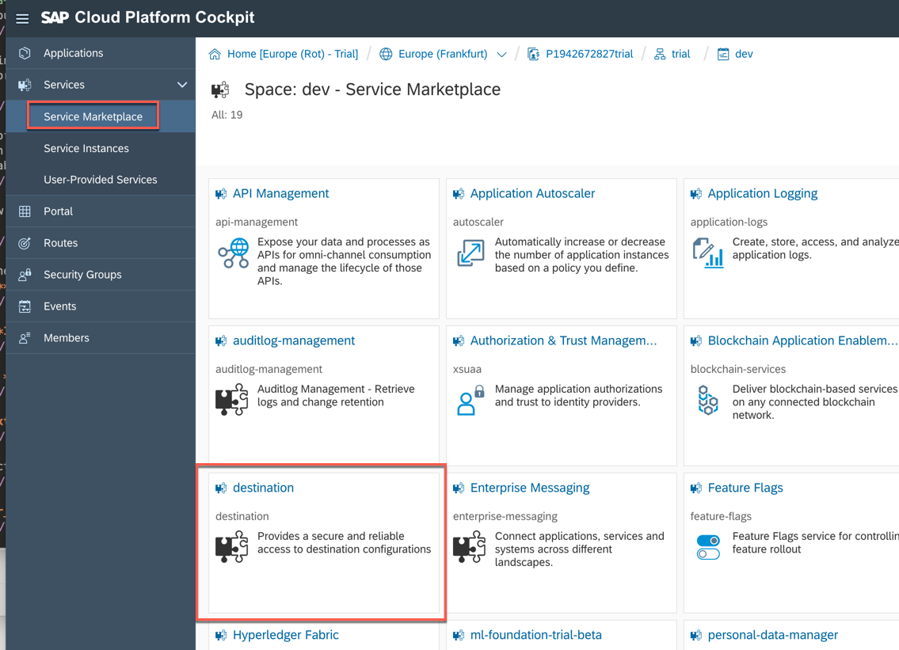
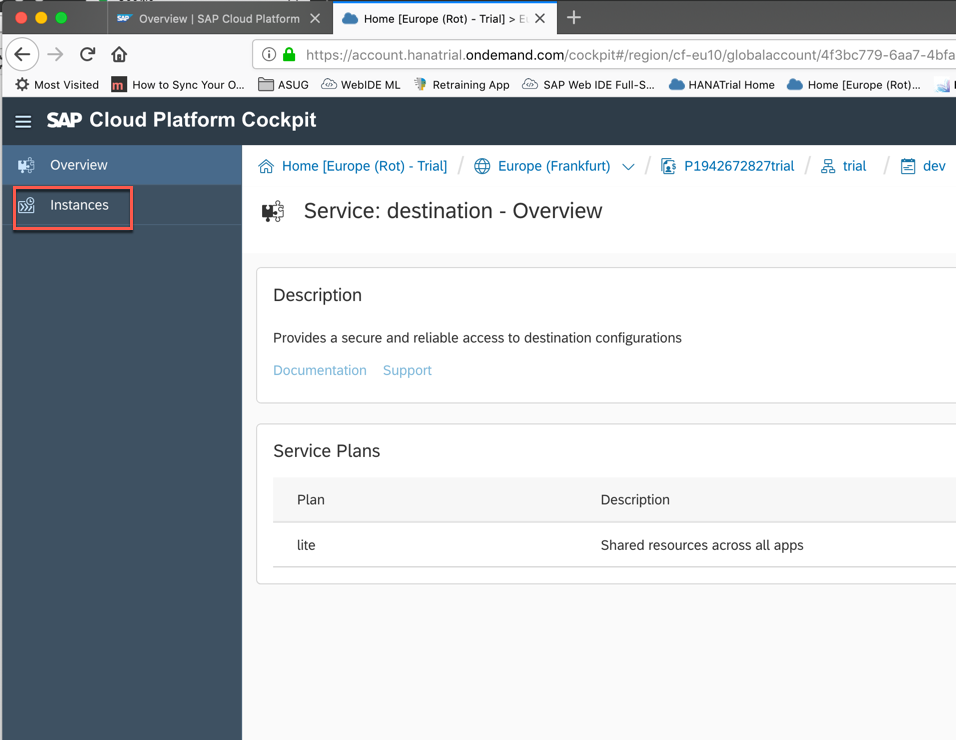

<table width=100% border=>
<tr><td colspan=2></td></tr>
<tr><td colspan=2><h1>EXERCISE 1_1 - Create service destinations on both SAP Cloud Platform Neo and Cloud Foundry environments</h1></td></tr>
<tr><td><h3>SAP S/4HANA Cloud Bootcamp</h3></td><td><h1> &nbsp;10 min</h1></td></tr>
</table>

## Description
In this exercise, you’ll learn how to 

* access SAP Cloud Platform NEO and Cloud Foundry environments
* create a Destination service instance in SAP Cloud Foundry and import the required destination 

## Target group

* Developers
* People interested in learning the SAP Cloud Platform Application Programming Model  

## Goal

The goal of this document is to set up some required services for the next exercises.  

## Prerequisites
  
Here below are prerequisites for this exercise.

* An account on the SAP Cloud Platform: it will be provided by your instructor along with the required credentials
* The destination file you can download [here](files/ErpQueryEndpoint_CF.zip). Extract it in a proper location on your disk

## Steps

1. [Adjust the destination in the Neo environment](#neo-destination)
1. [Create the destination services on SAP CF](#cf-destination)

### Adjust the destination in the Neo environment
In order to work with Application Programming Model and access the backend from SAP Web IDE we need to do a quick adjustment to the destination on Neo environment

1. Go to your SAP Cloud Platform Trial account <https://account.hanatrial.ondemand.com/cockpit> entering your credentials. Click on the **Neo Trial** environment  
	

1. Expand **Connectivity -> Destinations** and click on **New Destination**  
	

1. Enter the following values:

	| Parameter | Value |
	| --------- | ----- |
	| Name | ErpQueryEndpoint |
	| Type | HTTP |
	| Description | ErpQueryEndpoint |
	| URL | \<S4HANA\_ENDPOINT\> |
	| Proxy Type | Internet |
	| Authentication | BasicAuthentication |
	| User | \<S4HANA\_USERNAME\> |
	| Password | \<S4HANA\_PASSWORD\> |
	
	Add the following properties to the destination by click the **New Property** button. 

	>Note: proxyHost and proxyPort properties are only required on the Neo Trial so that it can reach the S/4HANA Cloud data center.

	| Property | Value |
	| --------- | ----- |
	| proxyHost | proxy-trial.od.sap.biz |
	| proxyPort | 8080 |
	| WebIDESystem | ErpQueryEndpoint |
	| WebIDEEnabled | True |
	| WebIDEUsage | odata_gen |
	
	At the end save the destination 
	
	
1. You can also check that the destination is working by clicking on the **Check Connection** button  
	

1. The response should be "302: Redirect". Click on **Close**  
	

1. Click on **Home** to go to the home page of your cockpit
	

### Create the destination services on SAP CF
Let's create a destination to the S/4HANA Cloud back-end for Cloud Foundry as well.

1. Click on the **Cloud Foundry Trial** environment of your Trial account 
	

1. Click on the **trial** subaccount
	
 
1. Take note of the **API Endpoint** you find on the right side because it will be required in the next exercises when we will ask you to specify your SAP Cloud Foundry API Endpoint; then click on **Spaces** in the left hand side toolbar    
	

1. Click on the **dev** space  
	

1. You are now into your space. It should be empty: if not, please delete any application you find since we require space for our exercise  
	

1. Click on the **Service Marketplace** and then on the **destination** tile to create an instance of the **destination** service  
	

1. Click on **Instances**  
	

1. Click on **New Instance**  
	

1. Choose the **lite** plan and click **Next**  
	

1. Click **Next**  
	

1. Don't select any application for the moment and click **Next** again  
	

1. Enter **s4hc_destination** as the instance name and click **Finish**  
	

1. Your **s4hc_destination** instance has been successfully created. Click on the name of this instance  
	

1. Select the **Destinations** tab on the left hand side and click on **Import Destination**  
	

1. Locate the file *ErpQueryEndpoint_CF* you extracted from the zip downloaded in the prerequisites to this exercise and import it  
	

1. Before clicking on **Save**, replace the existing URL and the credentials with the one you created in exercise 2_2  
	

1. After saving, you can check the new destination by clicking on the button **Check Connection**  
	

1. You should get the message **Connection to "ErpQueryEndpoint"" established. Response returned: "302: Redirect"**. Click on **Close**  
	

1. Congratulations! You have successfully completed this exercise.

## Summary
This concludes the exercise. You should have learned how to create a Destination service instance in SAP Cloud Foundry. Please proceed with the next exercise.
 