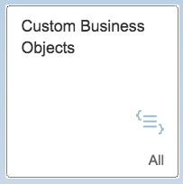
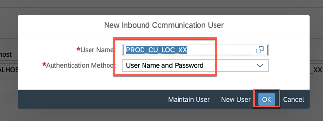
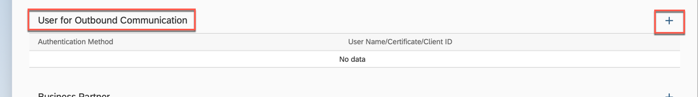
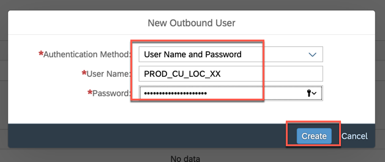
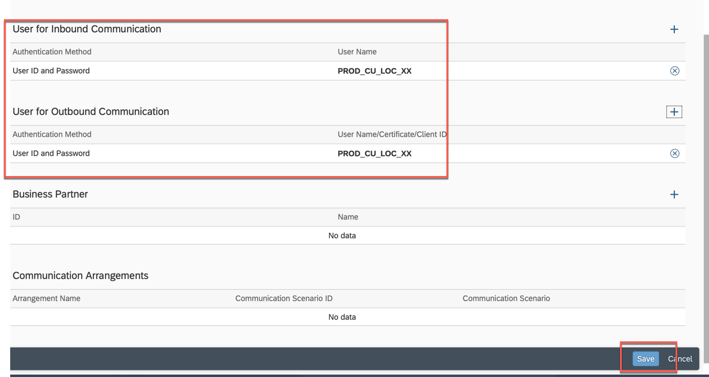
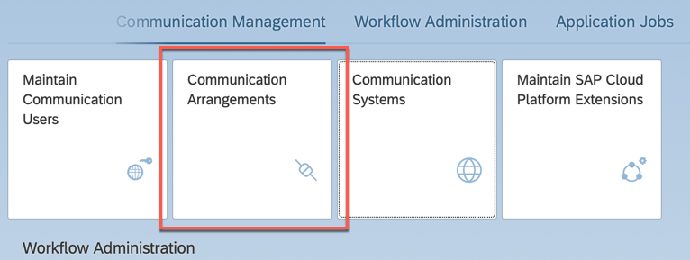
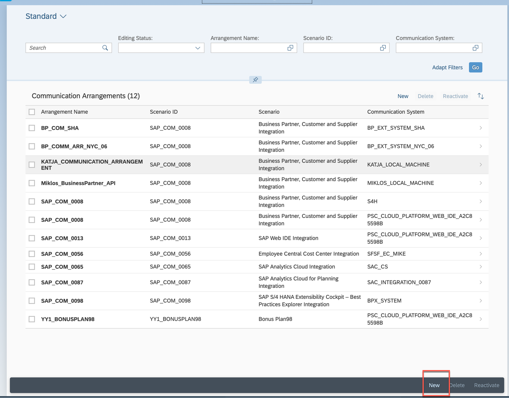

<table width=100% border=>
<tr><td colspan=2><h1>EXERCISE 12 - CREATE A UI FOR A CUSTOM BUSINESS OBJECT</h1></td></tr>
<tr><td><h3>SAP Partner Workshop</h3></td><td><h1> &nbsp;15 min</h1></td></tr>
</table>

## Description
In this exercise, you’ll learn how 

* to create an own application based on a Custom Business Object and a Custom Catalog Extension

For further reading on S/4HANA cloud in-app extension, click link below.
<https://jam4.sapjam.com/groups/m8lprEZwfU3zPoX0myj1Xu/overview_page/RfBJ6ix9q00bbSseaxm4zW>

## Target group

* Developers
* People interested in learning about S/4HANA Cloud extension and SDK  

## Goal

The goal of this exercise is to create UI for a custom business object.

## Prerequisites
  
Below are the prerequisites for this exercise.

* Google Chrome: Please complete this exercise using the Google Chrome browser
* **Authorizations:** Your user needs a business role with business catalog **Extensibility** (ID: `SAP_CORE_BC_EXT`)

## Steps

1. [Start Editing Custom Business Object Bonus Plan](#start-editing-custom-business-object)
1. [Generate UI](#generate-ui)
1. [Expose UI as Application](#expose-ui-as-application)
1. [Open Bonus Plan application](#open-bonus-plan-application)
1. [Test Bonus Plan application](#test-bonus-plan-application)

###  Start Editing Custom Business Object Bonus Plan

A several tutorials spanning example will show extensibility along custom Bonus Management applications.

In the first parts a Manager wants to define business objects "Bonus Plan" for employees. A Bonus Plan is there to save employee specific rules for bonus entitlement.

1. From the Home page, click on the **Custom Business Objects** application tile 

	
	
1. **Search** for Custom Business Object "PlanXX" (step1 + step2) and **open** the details by clicking the list item in the search result list (step3). Note: XX is the number assigned to you.

	
	
1. To be able to do changes to the published version of the business object, you need to start edit mode by executing the **Edit Draft** action. 

	
 
###  Generate UI

1. **Check** the two boxes for **UI Generation** and **Service Generation**.  

	
	
1. **Publish** the business object to trigger the generation of UI (Master and Detail) and OData Service.

	

###  Expose UI as Application

1. In order to make the UI available as SAP Fiori Launchpad application, you have to assign the object to a Business Catalog which corresponds to a group in Launchpad. 

1. From the Business Object's general information, go to Custom Catalog Extension application by clicking the **Maintain Catalogs** action.  

	
	
1. A new tab of window for "Custom Catalog Extensions" will open. 
1. Start adding a catalog with the **Add** action.  

	
	
1. Search for `Extensibility`. Select the Catalog with role ID `SAP_CORE_BC_EXT` and press **OK**.  

	
	 
1. **Select** the just added Catalog and **Publish** it.  

	
	
1. Click OK for the Confirmation.  

	
	
1. The publishing takes some minutes (5 to 11 minutes). The screen refreshes automatically once the status switches from unpublished to published.  You can close this application's window and proceed.  

	 

###  Open Bonus Plan application

1. Back in the Custom Business Object application's window, go to the SAP Fiori Launchpad via **Home** action.

	  
	
1. **Refresh** the Browser window with key **`F5`** for that the catalog extension becomes visible. Now there is the Bonus PlanXX application's tile in the **Extensibility** group.

1. **Start** the application by clicking the tile.  

	

###  Test Bonus Plan application

1. **Create** an object by clicking the "+".

	
	
1. **Enter** following data

	| Field | Value | Note |
	| :------------- | :--------------------|:-------------------- |
	| ID | xxxxxxxxxxxxxxxxxx1 | Replace the xxxxxxxxxxxxxxxxxx with space.  There are 18 spaces before 1.  |
	| Validity Start Date | 01/01/2018 |  |
	| Validity End Date | 12/31/2018 |  |
	| Target Amount | 1000.00 EUR |  |
	| Low Bonus Assignment Factor | 1 |  |
	| High Bonus Assignment Factor | 3 |  |
	| Employee ID | CBXXXXXXXXXX |  |

1. Employee ID CBXXXXXXXXXX shall be the one of a sales person that created sales orders with a Net Amount of more than 3000.00 EUR in 2018 and that are completed. In this exercise, you can use CB9980000008. 

	 
	
1. **Save** the Bonus Plan. The UI will automatically return from Bonus Plan Detail to Master.

1. You can see one entry in the list of bonus plans now.  

	
	
	
	
## Summary

This concludes the exercise. In the preceding tutorials, you created a custom business object with a simple data structure and its persistence. Then, you generated an UI for this business object and exposed it as an Fiori Launchpad application.
As the generated User Interfaces only list all fields of a business object node, adapting the UI might be necessary to improve usability of it.

Please proceed with next exercise.