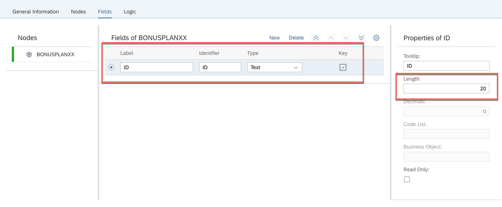

<table width=100% border=>
<tr><td colspan=2><h1>EXERCISE 1_3 - CREATE A CUSTOM BUSINESS OBJECT</h1></td></tr>
<tr><td><h3>SAP S/4HANA Cloud Bootcamp</h3></td><td><h1> &nbsp;15 min</h1></td></tr>
</table>

## Description
In this exercise, you’ll learn how 

* to create a custom business object that has a simple data structure and publish it
* to define the data structure and create the database persistence of a custom business object

For further reading on S/4HANA cloud in-app extension, click link below.
<https://jam4.sapjam.com/groups/m8lprEZwfU3zPoX0myj1Xu/overview_page/RfBJ6ix9q00bbSseaxm4zW>

## Target group

* Developers
* People interested in learning about S/4HANA Cloud extension and SDK  

## Goal

The goal of this exercise is to create a custom business object.

## Prerequisites
  
Below are the prerequisites for this exercise.

* Google Chrome: Please complete this exercise using the Google Chrome browser
* **Authorizations:** Your user needs a business role with business catalog **Extensibility** (ID: `SAP_CORE_BC_EXT`)

## Steps

1. [Starting Custom Business Objects application](#starting-custom-business-objects-application)
1. [Creating a new Custom Business Object](#creating-a-new-custom-business-object)
1. [Defining the data structure](#defining-the-data-structure)
1. [Adding standard data to the structure](#Adding-standard-data-to-the-structure)
1. [Creating the database persistence](#creating-the-database-persistence)

###  Starting Custom Business Objects application

A several tutorials spanning example will show extensibility along custom Bonus Management applications.
As applications are based on business objects, it all starts with custom business object creation.

In the first part, a Manager wants to define business objects "Bonus Plan" for employees. A Bonus Plan is there to save employee specific rules for bonus entitlement.

**Start** with checking the prerequisite role.

1. Logon to the S/4HANA Cloud system.  The presenter will provide you the logon user and password.  The **XX** is the number that you have been assigned to use for the exercise. 
	
	
1. You will see applications for the catalog of Extensibility.  
	

###  Creating a new Custom Business Object

1. **Create** the Custom Business Object's application by clicking its tile 

	
	
1. Press the **New** action to start creation of a Custom Business Object  

	
	
1. In the opening pop Up **fill** in the Name "Bonus PlanXX". The other editable fields will get proposals automatically but can be changed.  

	 
	
1. Execute the **Create** action.

###  Defining the data structure

1. In the following view for editing the custom business object, click on **Fields** tab of the "Bonus PlanXX".  

	 
	
1. Click on **New** to create new field for the object. 

	 
	
1. Enter "ID" for the "Label". Choose "Text" for the Type. Keep 20 for the Length. Check the Key checkbox. 

	
	
1. Repeat the above 2 steps to **create** following fields by clicking on **New** for each field.

	| Field Name (Label)     | Field Properties             | Tooltip     |
	| :------------- | :--------------------------- | :-----------|
	| ID             | Text of length 20, **key field** |Note: You have created ID on previous step.|   
	| Validity Start Date | Date    | |
	| Validity End Date | Date | |   
	| Target Amount | Amount with Currency | |   
	| Low Bonus Assignment Factor | Number of length 4, decimals 2 | Actual revenue must meet target more than that many times |
	| High Bonus Assignment Factor | Number of length 4, decimals 2 | Actual revenue must meet target more than that many times |
	| Low Bonus Percentage | Quantity with Unit | |   
	| High Bonus Percentage | Quantity with Unit  | |
	| Is Consistent | Checkbox, **Read Only**  | |
	| Employee ID | Text of length 12  | |
	| Employee Name | Text of length 40, **Read Only**   | |

1. The UI for maintaining fields looks as follows. 

	 

###  Adding standard data to the structure

1. Back in the business Object's **General Information** tab, **check** the **System Administrative Data** box to add standardized fields for `Created On`, `Created By`, `Last Changed On` and `Last Changed By`.  

	
	
	By checking this box the four fields also appear as uneditable in the field list.  These fields will be filled and updated automatically, so that you do not need to implement logic for this. Logic implementations for these fields even would be ignored.
	
	

###  Creating the database persistence

1. **Publish** the Business Object `Bonus PlanXX`.  

	
	
	This creates the database persistence of the Business Object.
	
1. You will see **Published** in green for this object when the publishing is completed. 

	

## Summary
This concludes the exercise. You should have learned how to create a custom business object that has a simple data structure and publish it. At the end, there will be a database table for the business object. 

Please proceed with next exercise.
