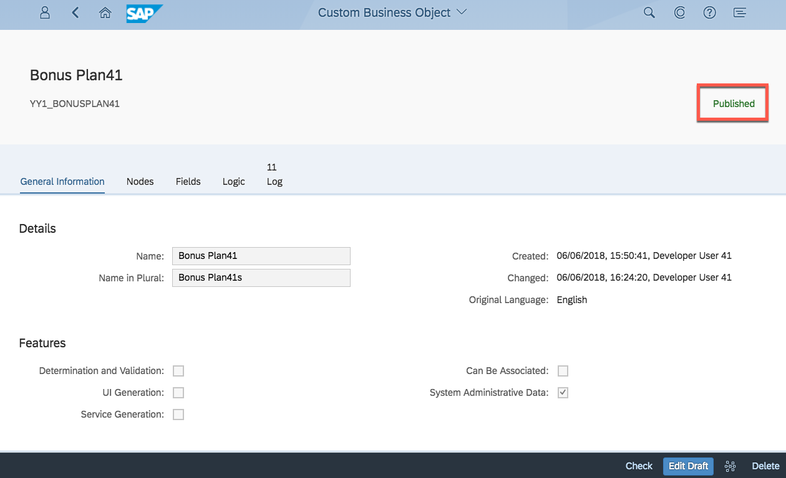

<table width=100% border=>
<tr><td colspan=2><h1>EXERCISE 13 - IMPLEMENTING LOGICS FOR A CUSTOM BUSINESS OBJECT</h1></td></tr>
<tr><td><h3>SAP S/4HANA Cloud Bootcamp</h3></td><td><h1> &nbsp;30 min</h1></td></tr>
</table>


## Description
In this exercise, you’ll learn how 

* to implement logic to set some data from the backend only and to check all data of an instance.
* to ease development and test already while doing it.

For further reading on S/4HANA cloud in-app extension, click link below.
<https://jam4.sapjam.com/groups/m8lprEZwfU3zPoX0myj1Xu/overview_page/RfBJ6ix9q00bbSseaxm4zW>


## Target group

* Developers
* People interested in learning about S/4HANA Cloud extension and SDK  


## Goal

The goal of this exercise is to implement custom business object logic to control your application.


## Prerequisites
  
Below are the prerequisites for this exercise.

* Google Chrome: Please complete this exercise using the Google Chrome browser
* **Authorizations:** Your user needs a business role with business catalog **Extensibility** (ID: `SAP_CORE_BC_EXT`)


## Steps

1. [Make key field Read-Only](#make-key-field-read-only)
1. [Enable logic implementation](#enable-logic-implementation)
1. [Start logic implementation](#start-logic-implementation)
1. [Implement After Modification: fix values](#implement-after-modification-fix)
1. [Implement After Modification: consistency check](#implement-after-modification-consistency)
1. [Test the logic during development](#test-the-logic-during-development)
1. [Implement Before Save](#implement-before-save)
1. [Test via the UI](#test-via-the-UI)

### <a name="make-key-field-read-only"></a> Make key field Read-Only

A several tutorials spanning example will show extensibility along custom Bonus Management applications.

In the first parts a Manager wants to define business objects "Bonus Plan" for employees. A Bonus Plan is there to save employee specific rules for bonus entitlement.

As there was no backend implementation to set the mandatory key field **`ID`** so far, we were forced to set it from the UI to be able to save instances.
Now, as we will implement the logic to set the ID in backend and nowhere else, we will set that key field to Read-Only for the UI.

1. Open the business object **Bonus PlanXX** in **Custom Business Objects** application. 

	
	
1. Start Edit Mode by executing the **Edit Draft** action. 

	 
	
1. Click on the **Fields** tab. **Check** the Read-Only box for key field **`ID`**.  

	
	

### <a name="enable-logic-implementation"></a> Enable logic implementation

1. Navigate to **General Information** tab. **Check** the box for **Determination and Validation**. **Publish** the business object definition.

	
	
	Now you are enabled to implement **determination logic** which is called **after each modification** to a Bonus Plan instance from the UI, as well as **validation logic** which is called **before each save** of an instance.

### <a name="start-logic-implementation"></a> Start logic implementation

For **published** Custom Business Objects **without a Draft version** you can implement logic.

1. Navigate to the **Logic** tab.

	 
	
1. Click on the **After Modification** Event Logic which is a Determination Logic.

	
	
1. In the logic view, you initially see the not editable empty published version. Click the **Create Draft** action.

	
	
1. An editable copy of the published version appears on the left. With the **Draft Version** and **Published Version** actions you can decide what coding to see.

	

### <a name="implement-after-modification-fix"></a> Implement After Modification: fix values

Implement After Modification event with following fix value functionality:

1. Set the key field `ID` if still initial.

	>**Hint:** Changing Parameter `bonusplanXX` enables you to read current node data and change it. 
	
	>**Hint:** You can read existing Bonus Plan data via the CDS View that is named as the Business Object's Identifier (here: `YY1_BONUSPLANXX`). 
	
	>**Hint:** With the key combination **CTRL + Space** you can access the very helpful code completion. 

	

	Note: Replace XX to the number assigned to you.

	```
	* set ID
	IF bonusplanXX-id IS INITIAL.
	   SELECT MAX( id ) FROM yy1_bonusplanXX INTO @DATA(current_max_id).
	   bonusplanXX-id = current_max_id + 1.
	ENDIF.
	```

1. Set the Unit of Measure for the Bonus Percentages to `P1` which is the code for % (percent)

	```
	* set percentage unit
	bonusplanXX-lowbonuspercentage_u = bonusplanXX-highbonuspercentage_u = 'P1'.
	```

1. Determine and set the Employee Name from the Employee ID
	>**Hint:** Extensibility offers Helper class `CL_ABAP_CONTEXT_INFO` with method `GET_USER_FORMATTED_NAME` that needs a user ID to return its formatted name

	```
	* set Employee Name
	IF bonusplanXX-employeeid IS NOT INITIAL.
	   bonusplanXX-employeename = cl_abap_context_info=>get_user_formatted_name( bonusplanXX-employeeid ).
	ENDIF.
	```

### <a name="implement-after-modification-consistency"></a> Implement After Modification: consistency check

1. In dependence on following checks, set the `isconsistent` property.

	- Check that `ValidityStartDate` and `ValidityEndDate` are set and that `ValidityStartDate` is earlier in time than `ValidityEndDate`.
	- Check that Factors and Percentages are set correctly (all > 0, Percentages < 100, `LowBonusAssignmentFactor` < `HighBonusAssignmentFactor`)
	- Check that Employee ID is set

1. Enter the consistency check coding.
	
	```
	* consistency check START
	IF bonusplanXX-validitystartdate IS INITIAL
	 OR bonusplanXX-validityenddate IS INITIAL
	 OR bonusplanXX-validitystartdate GE bonusplanXX-validityenddate
	 OR bonusplanXX-lowbonusassignmentfactor IS INITIAL
	 OR bonusplanXX-highbonusassignmentfactor IS INITIAL
	 OR bonusplanXX-lowbonuspercentage_v IS INITIAL
	 OR bonusplanXX-highbonuspercentage_v IS INITIAL
	 OR bonusplanXX-lowbonuspercentage_v GE 100
	 OR bonusplanXX-highbonuspercentage_v GE 100
	 OR bonusplanXX-lowbonusassignmentfactor GE bonusplanXX-highbonusassignmentfactor
	 OR bonusplanXX-employeeid IS INITIAL
	 OR bonusplanXX-targetamount_v IS INITIAL
	 OR bonusplanXX-targetamount_c IS INITIAL.
	    bonusplanXX-isconsistent = abap_false.
	ELSE.
	    bonusplanXX-isconsistent = abap_true.
	ENDIF.
	* consistency check END
	```

### <a name="test-the-logic-during-development"></a> Test the logic during development

On top of the coding you can maintain runtime data for the current node structure which represents the data before running the test functionality. This data can also be saved as variant for later usages.

1. Click the value help to add test data

	

1. Enter following data

	| Field	Name | Field Value |
	|------------|-------------|
	| validitystartdate | 2018-01-01 |
	| validityenddate | 2018-12-31 |
	| targetamount_v | 1000 |
	| targetamount_c | EUR |
	| lowbonusassignmentfactor | 1 |
	| highbonusassignmentfactor | 3 |
	| lowbonuspercentage_v | 10 |
	| highbonuspercentage_v | 20 |
	| employeeid | CBXXXXXXXXXX |

	"employeeid" CBXXXXXXXXXX shall be the one of a sales person that created sales orders with a Net Amount of more than 3000.00 EUR in 2016 and that are completed. In this exercise, you can use CB9980000008. 

	This will look as follows.
	
	
	
	Click **OK**.
	
	

1. Execute the **Test** action.
   
    

1. You can see the node data after your logic was executed.

	
	
	
	
	You can see that your logic works as "id", "percentage_u" fields and "employename" are filled and "isconsistent" is 'X'.
	
1. **Publish** the After Modification.

	
	
1. Go back.

	


### <a name="implement-before-save"></a> Implement Before Save

1. Click on **Before Save**.

	
	
1. Click on **Create Draft**.

	

1. **Implement** Before Save event with following functionality

	If the bonus plan is consistent, it can be continued to save. If it is not consistent, save will be rejected. In case of save no further processing is needed and logic can be ignored.
	>**Hint:** Exporting parameter valid must be set to true for save and to false for rejection

	```
	* decide about save rejection
	IF bonusplanXX-isconsistent EQ abap_true.
   	 valid = abap_true.
   	 RETURN.
	ELSE.
   	 valid = abap_false.
	ENDIF.
	```

1. If the bonus plan is not consistent, write the first found error into the message and end the logic processing.
These are the possible errors in detail:
      - ValidityStartDate and ValidityEndDate must be set
      - ValidityStartDate must be earlier in time than ValidityEndDate
      - Factors and Percentages must be > 0
      - Percentages must be < 100
      - LowBonusAssignmentFactor must be < HighBonusAssignmentFactor
      - Empoyee ID must be set

	```
	* consistency error message START
	IF bonusplanXX-validitystartdate IS INITIAL OR bonusplanXX-validityenddate IS INITIAL.
	    message = 'Validity Period must not be empty.'.
	    RETURN.
	ELSEIF bonusplanXX-validitystartdate GE bonusplanXX-validityenddate.
	    CONCATENATE 'Validity End Date' bonusplanXX-validityenddate 'must be later than Validity Start Date' bonusplanXX-validitystartdate '!' INTO message SEPARATED BY space.
	    RETURN.
	ENDIF.
	
	IF bonusplanXX-targetamount_v IS INITIAL OR bonusplanXX-targetamount_v = 0.
	    message = 'Target Amount must be over 0!'.
	    RETURN.
	ENDIF.
	
	IF bonusplanXX-targetamount_c IS INITIAL.
	    message = 'Target Amount Currency must be set!'.
	    RETURN.
	ENDIF.
	
	IF bonusplanXX-lowbonusassignmentfactor IS INITIAL
	 OR bonusplanXX-highbonusassignmentfactor IS INITIAL.
	    message = 'Assignment Factors must be over 0!'.
	    RETURN.
	ENDIF.
	
	IF bonusplanXX-lowbonuspercentage_v IS INITIAL
	 OR bonusplanXX-highbonuspercentage_v IS INITIAL.
	    message = 'Percentages must be over 0!'.
	    RETURN.
	ENDIF.
	
	IF bonusplanXX-lowbonuspercentage_v GE 100
	 OR bonusplanXX-highbonuspercentage_v GE 100.
	    message = 'Percentage must be below 100!'.
	    RETURN.
	ENDIF.
	
	IF bonusplanXX-lowbonusassignmentfactor GE bonusplanXX-highbonusassignmentfactor.
	    message = 'Low Bonus Factor must be smaller than High Bonus Factor!'.
	    RETURN.
	ENDIF.
	
	IF bonusplanXX-employeeid IS INITIAL.
	    message = 'Employee ID must be set!'.
	    RETURN.
	ENDIF.
	* consistency error message  END
	```

1. **Publish** the Before Save Logic.

	
	
1. Go back and check both After Modication and Before Save are Published.

		
1. Go home.

		
	
### <a name="test-via-the-UI"></a> Test via the UI

Once ensured that both logic implementations were successfully published, you can start testing the application like an end user via the UI.

1. **Open** the Bonus PlanXX application. 

	
	
1. Click on Go. **Open** the Bonus Plan with ID `1`.

	
1. **Edit** this Bonus Plan.

	
1. **Enter** value `10` into field **Low Bonus Percentage**

	
1. **Save** the Bonus plan. Save fails due to the validation error messages for missing percentages.

	
	
1. Close the Message.
1. **Enter** value `20` into field **High Bonus Percentage**

	
1. **Save** the Bonus Plan. Now it will not be rejected. 

	
	
1. You can see that your business logic works as the Percentage Units and the Employee Name get filled. Note: If you don't see the Employee Name, refresh the page and it will show.

	
	

## Summary
This concludes the exercise. You should have learned how to implement logic to set some data from the backend and to check all data of an instance.

You have also learned how to ease development and test already while doing it.

Please proceed with next exercise.
