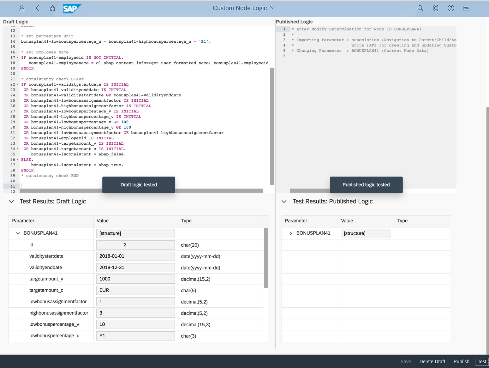
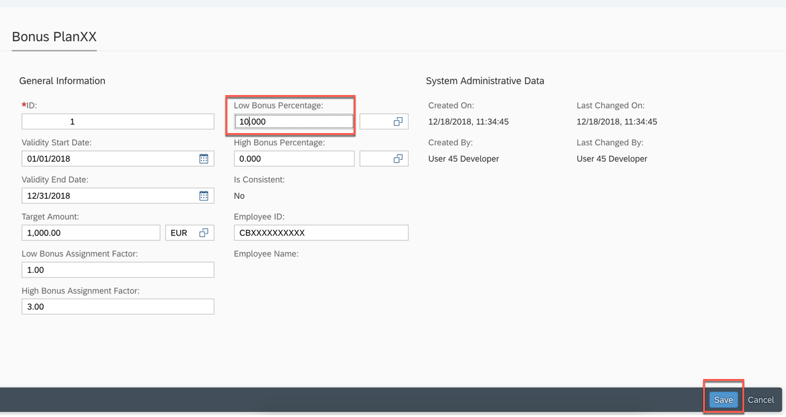
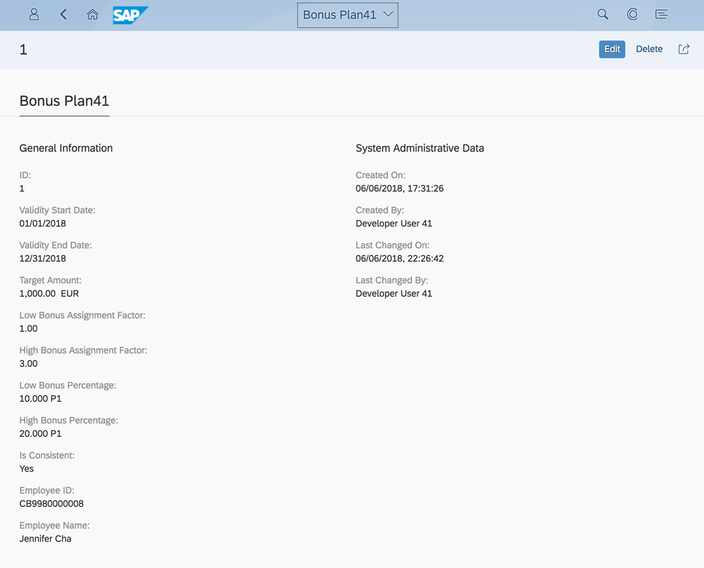
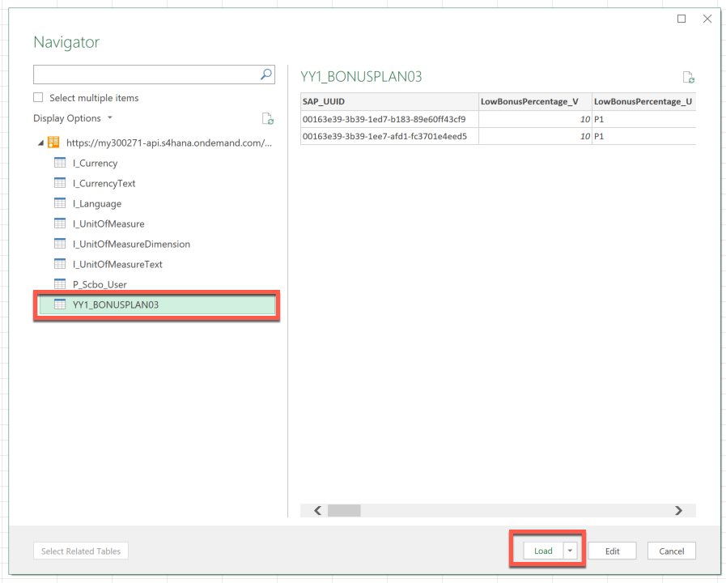

<table width=100% border=>
<tr><td colspan=2><h1>EXERCISE 15 - CUSTOM BUSINESS OBJECT EXPOSURE AS EXTERNAL WEB SERVICE</h1></td></tr>
<tr><td><h3>SAP Partner Workshop</h3></td><td><h1> &nbsp;50 min</h1></td></tr>
</table>

## Work in Process for update

## Description
In this exercise, you’ll learn how 

* to expose the custom business object as web service for integration of your solution with other systems.


For further reading on S/4HANA cloud in-app extension, click link below.
<https://jam4.sapjam.com/groups/m8lprEZwfU3zPoX0myj1Xu/overview_page/RfBJ6ix9q00bbSseaxm4zW>


## Target group

* Developers
* People interested in learning about S/4HANA Cloud extension and SDK  


## Goal

The goal of this exercise is to expose the custom business object as web service for integration of your solution with other systems.


## Prerequisites
  
Below are the prerequisites for this exercise.

* Complete previous exercises.
* Google Chrome: Please complete this exercise using the Google Chrome browser
* **Authorizations:** Your user needs a business role with business catalog **Extensibility** (ID: `SAP_CORE_BC_EXT`)
* To be able to use the Communication Management Applications, your user needs Business Catalog (ID: `SAP_CORE_BC_COM`)
* Having installed standalone **POSTMAN** application from <https://www.getpostman.com> and disabled “SSL certificate verification”
* Having Microsoft Excel installed.

## Steps

1. [Creating a Custom Communication Scenario](#creating-a-custom-communication-scenario)
1. [Creating a Communication System and User](#creating-a-communication-system-and-user)
1. [Creating a Communication Arrangement](#creating-a-communication-arrangement)
1. [Testing and Calling the Service](#testing-and-calling-the-service)
1. [Consumption from SAP Cloud Platform](#consumption-from-SAP-Cloud-Platform)


### <a name="creating-a-custom-communication-scenario"></a> Creating a Custom Communication Scenario

A communication scenario is the basis definition for a communication between systems. It defines a solution to be made available for external systems.

1. Open Custom Communication Scenario Application

	 
1. Start creating a new scenario by executing the “New” action.

	 
1. Give following data to the new custom communication scenario ...


	| Field Caption | Field Value |
	|------------|-------------|
	| ID| BonusplanXX |
	| Description | Bonus PlanXX |
	Note: XX is the number assigned to you for the exercise.

	  
	
	... and create the scenario by executing the “New” action.
	
1. Start adding an inbound communication service by executing the “+” action

	 
1. Search for `YY1_BONUSPLAN`. Choose service `YY1_BONUSPLANXX_CDS` and execute the “OK” action. 

	
	
	**Background**: That service had been created during Custom Business Object “Bonus Plan” publishing as in its definition the OData Service Generation flag was set for UI creation already.
	
	
1. Publish the Custom Communication Scenario.

	
	

### <a name="creating-a-communication-system-and-user"></a> Creating a Communication System and User

To enable secure communication between different systems you have to register these systems and define the user which is authorized to use the connection.

The communication system represents the communication partner within a communication. For inbound communication, this is the external system that calls our Bonus Plan service.

We’ll create one Communication System for all systems that want to use our service as well as the user that they’ll have to use.

1. Open “Communication Systems” Application.

	
1. Start creating a new system by executing the “New” action.

	
1. Give following data to the new custom communication scenario …

	| Field Caption | Field Value |
	|------------|-------------|
	| System ID | EXTERNAL_SYSTEMXX |
	| System Name | External SystemXX |
	Note: XX is the number assigned to you for the exercise. 

	 
	… and create the system by executing the “Create” action.
	
1. In the Opening Details view, fill the "Host Name" and "Business System" with “External SystemXX” as well. 

	 
1. Scroll down to “User for Inbound Communication” and start adding one by executing the “Add” action.

	
1. In the opening Pop Up, start creating a new User by executing the “New User” action. 

	
1. This will lead to an automatic switch to the “Create Communication User” application, where you enter User Name “EXTERNAL_USERXX”, Description “User for External SystemXX Communication System” and a password before you execute the “Create” action. Note: The password has mininum length of 20 characters containing at least 1 special characters, for example "Welcome!23Welcome!23".

	 
1. This will switch you back to the Pop Up, where the User Name is filled now and you can confirm to add the Inbound Communication User with action “OK”.
The just created user will be needed by callers to make use of the services. 

	
1. Back in the Communication System details you finish its creation with action “Save”. Go back to Lauchpad Home page.

	 
	
### <a name="creating-a-communication-arrangement"></a> Creating a Communication Arrangement

Finally, a communication arrangement links the solution’s scenario with the Communication system and its user and exposes the Service to be used.

1. Open “Communication Arrangements” Application

	
1. Start creation by executing the “New” action. 

	
1. A pop up opens in that you use the value help for Scenario first.

	
1. Select the YY1_BONUSPLANXX Scenario.

	
1. This will set the Scenario and default the Arrangement Name, so that you can continue the creation via “Create” action. 

	 
1. In the opening Arrangement details you only need to set the “Communication System” to `EXTERNAL_SYSTEMXX`, which will automatically set the related User Name `EXTERNAL_USERXX` as well.
Execute “Save” to finish creation. 

	
1. Copy the Service URL for the next step.

	

### <a name="testing-and-calling-the-service"></a> Testing and Calling the Service

POSTMAN application is there to test Web services by sending requests and receiving responses.
All included postman screenshots are reprinted with permission © Postdot Technologies Inc. All rights reserved.

#### General test ####

1. Start the POSTMAN application. Ensure that you have disabled “SSL certificate verification” (File > Settings > General)

	
1. Enter the Service URL and execute **Send** action.

   You will get **401 Unauthorized** as response in the response section if you start the POSTMAN from the chrome browser which has certificate that belongs to other system.
   
   You will get **200 OK** as response in the response section if you start the POSTMAN from the chrome browser which you have logon to the S/4HANA system.
   
   The response indeicates that the system is reachable. 
	
	
1. Change authorization type to **Basic Auth** now, enter Username **EXTERNAL_USERXX** and the Password that you set for External_USERXX. Click on **Update Request**. **Send** the service request again. 

	
	
1. Now you will get a successful response **200 OK** of the service. This way you can test, if the service is working in general.

	

#### Create a Bonus Plan instance ####

**Get X-CSRF-Token**

Whenever you want to do a change to the Custom Business Object’s persistence, for security reasons you need to send a **X-CSRF-Token** with that changes request. To get such a token, you have to send a get request first to fetch it.

1. Enter the basic service request URL of Bonus Plans
1. Ensure to be on “Headers” tab.
1. Enter the new header key “X-CSRF-Token” with value “fetch”
1. Send the request. 
1. Copy the returned X-CSRF-Token to clipboard. 

	 
	
	The fetched token will be valid for **30** minutes and fetching a token will return the same as long as validity has not ended yet.

**Create Instance**

To create a new bonus plan via the service, do the following in postman.

1. Change the request method to **POST**.
1. As the basic service URL returns only the overview of all reachable Entity Sets (= Collections), you have to narrow it down for Bonus Plans by appending their Entity Set name `/YY1_BONUSPLANXX`
1. Paste the previous fetched X-CSRF-Token as value to the corresponding header key
1. Add new header key **Accept** with value `application/json`, this will ensure that the response will be gotten in JSON format, which is easier to work with than XML.
1. Add new header key **Content-Type** with value `application/json`

	
	
1. Switch to the Body tab
1. Set the body type to **raw**
1. Set the editor type **JSON (application/json)**, which will enable correct syntax highlighting and header key for Content-Type
1. Enter the initial data for the to be created bonus plan in JSON format to the editor
	
	```
	{
        "ValidityStartDate": "/Date(1514764800000)/",
        "ValidityEndDate": "/Date(1546214400000)/",
        "LowBonusPercentage_V": "10.000",
        "HighBonusPercentage_V": "20.000",
        "EmployeeID": "<any>",
        "TargetAmount_V": "1000.00",
        "TargetAmount_C": "EUR",
        "LowBonusAssignmentFactor": "1.00",
        "HighBonusAssignmentFactor": "3.00"
	}
	```
	
	**ValidityStartDate** "/Date(1514764800000)/" is the json format for 01/01/2018. 
	
	**ValidityEndDate** "/Date(1546214400000)/" is the json format for 12/31/2018. 
	
	**EmployeeID** "<any>" shall be the one of a sales person that created sales orders with a Net Amount of more than 3000.00 EUR in 2018 and that are completed. In this exercise, you can use "CB9980000008" or your own ID.
	
1. **Send** the request. 

	 

1. You will get **201 Created** status. You will see a new instance has been created. From the **ID** you can see, that it’s a new one and the logic automatically fill the data accordinly.

	 
	
#### Update a Bonus Plan instance ####

**Get SAP_UUID**

To update an instance, you have to use the internal SAP_UUID as technical key. To get this unique key, do the following steps

1. Switch the request method to **GET** and enter the request URL for bonus plan entities with the parameters 

	| Parameter Name | Parameter Value | Description  |
	|------------|-------------|-------------|
	| filter | ID eq ‘                  2’ | filters for bonus plan of which the semantic key “ID” has value 2  |
	| select | SAP_UUID | restricts response data for the chosen bonus plan to its SAP_UUID    |
	
	
	The request will look like below:
	
	**https://\<YOUR\_SYSTEMS\_URL\>/sap/opu/odata/sap/YY1\_BONUSPLANXX\_CDS/YY1\_BONUSPLANXX?$select=SAP\_UUID&$filter=ID%20eq%20'&nbsp;&nbsp;&nbsp;&nbsp;&nbsp;&nbsp;&nbsp;&nbsp;&nbsp;&nbsp;&nbsp;&nbsp;&nbsp;&nbsp;&nbsp;&nbsp;&nbsp;&nbsp;2'**
	
	Pay attention to the ID number.  We have define the ID as "Text of length 20". The ID has length 20.
	
	This is the example for using our system:
	**https://my301290\-api.s4hana.ondemand.com/sap/opu/odata/sap/YY1\_BONUSPLANXX\_CDS/YY1\_BONUSPLANXX?$select=SAP\_UUID&$filter=ID%20eq%20'&nbsp;&nbsp;&nbsp;&nbsp;&nbsp;&nbsp;&nbsp;&nbsp;&nbsp;&nbsp;&nbsp;&nbsp;&nbsp;&nbsp;&nbsp;&nbsp;&nbsp;&nbsp;2'**
	
1. **Send** the request.

1. Copy **SAP_UUID** to clipboard.

	 

**Update**

1. Switch the request method to **PATCH**.
1. Enter the request URL for a bonus plan entity. And add the previous gotten **guid** to the end following this syntax `(guid'<guid_value>’)`, for example `/YY1_BONUSPLANXX(guid’8cdcd4a8-05c0-1ed7-8ec1-84ed870dedb5′)`
	
	The request will look like below:
	
	`https://<YOUR_SYSTEMS_URL>/sap/opu/odata/sap/YY1_BONUSPLANXX_CDS/YY1_BONUSPLANXX(guid'<guid_value>')`
	
	This is the example for using our system:

	`https://my301290-api.s4hana.ondemand.com/sap/opu/odata/sap/YY1_BONUSPLANXX_CDS/YY1_BONUSPLANXX(guid'00163e59-c752-1ee8-91d9-5b81e449bccd')`
	
1. Enter following JSON to the body

	```
	{
    "ValidityStartDate": "/Date(1514764800000)/",
    "ValidityEndDate": "/Date(1546214400000)/"
	}
	```
	
1. **Send** the request

1. You will see that the update worked as you do get an empty body as response.

	 

#### Using the service (Optional) ####
Note 1 : You can skip this exercise if you have MacBook. 

Note 2: This exercise only works for Microsoft Office 365.  If you have older version of the Microsoft Office, it does not work.

1. Open Microsoft Excel with a new “Book” (= excel file)
1. Go to “Data” tab > “New Query” > “From Other Sources” > “From OData Feed”

	
1. A pop up opens in that you enter the service URL and execute “OK”.

	
1. In the next Pop Up for Access to the Service (= OData feed) switch on the left side from “Anonymous” to “Basic”, then enter Username “dummy” and its Password on the right side, before executing the “Connect” action.

	
1. In the next screen select the item YY1_BONUSPLANXX and execute “Load”. 

	
1. As result the excel workbook will be filled with the current Bonus Plan entities’ data. 

	
	
### <a name="consumption-from-SAP-Cloud-Platform"></a> Consumption from SAP Cloud Platform

**Use SAP Cloud Platform trial account**

You can use a service in SAP Cloud Platform in many different way. You can use it to build a new UI, you can call it in your Java or JavaScript coding, you can use it in Cloud Integration iFlows. Here I want to show only one simple use case on how to consume it: SAP Web IDE.

1.	Access SAP Cloud Platform trial account from <https://account.hanatrial.ondemand.com/> by clicking on the **Log On** button. After you have logged in, click on **Neo Trial**. This will take you to the **Overview** page of the SAP Cloud Platform Cockpit for the Neo stack.

	

1.	Create destination in SAP Cloud Platform. Open your SAP Cloud Platform account. Go to **Connectivity > Destinations**.

	Create a new destination with the following attributes:
	- Name: choose a name for example “S4HC”
	- Type: HTTP (this includes HTTPS, which is used)
	- Description: choose a description for example “S4HC”
	- URL: enter the URL of you S4HC account, for example “https://myserver-api.s4hana.ondemand.com”
	- Proxy Type: Internet
	- Authentication: BasicAuthentication
	- User & Password: enter the external_userxx / pwd
	- Check “Use default JDK truststore” for security settings
	- Set the Additional Properties:
		- WebIDEEnabled: true
		- WebIDESystem: name of the system, e.g. “S4HANA”
		- WebIDEUsage: odata_gen
	
	
	| Field | Field Value | 
	|------------|-------------|
	| Name | S4HC | 
	| Type | HTTP | 
	| Description| S4HC  | 
	| URL | https://my301290-api.s4hana.ondemand.com | 
	| Proxy Type | Internet | 
	| Authentication | BasicAuthentication | 
	| User | EXTERNAL_USERXX | 
	| Password | xxxxxxxxxxxxxxxxxxxx | 
	| WebIDEEnabled | true | 
	| WebIDESystem | S4HC | 
	| WebIDEUsage | odata_gen | 	
	
	Save the destination.

	 
	
1.	Start SAP Web IDE Full-Stack to create the application. From SAP Cloud Platform account dashboard, select Services. Search for **SAP Web IDE Full-Stack**. 

	
1.	Go to SAP Web IDE Service.

	
1.	Select: **New Project from Template**.

	
	
1.	Select **SAP Fiori Worklist Application**. Click **Next**.

	
	
1.	Enter the basic information for the project.
	
	| Field | Field Value | 
	|------------|-------------|
	| Project Name | bonusplanXX | 
	| Title | Bonus Plan XX | 
	| Namespace | com.sap.bonus | 
	
	Click **Next**.

	
	
1.	On the step Data Connection, select **Service URL**. Select the destination you created before (S4HC) and the relative path of the OData service, as given in the Communication Arrangement screen (`/sap/opu/odata/sap/YY1_BONUSPLANXX_CDS`). You can now discover the details of the service and you can even discover the live data. Click on **Test**. Click on **Next**.

	 
	
1. Continue with the creation wizard to create a Fiori app out of the OData service. See below screen as an example. Click on **Next**.

	 
	
1. Click **Finish**.

	 
	
1. The project of "bonusplanXX" is created. Expand the project folder bonusplanXX > webapp. Preview the application by click on **Index.html** file and click on preview button.

	

1. Preview application will display on another tab. 

	
	
	 


**Use Configured SAP Web IDE with S/4HANA Cloud**

The following are the steps for using the SAP Web IDE tile to develop the apps and deployment back to SAP S/4HANA Cloud. 

1. Click on **SAP Web IDE** tile

	
	
1. It will launch a new tab from the browser to access the "SAP Web IDE Full-Stack" tool from the SAP Cloud Platform whcih has configured for the extension of this S/4HANA Cloud system.

	

1. Click on **Welcome** icon on the left panel to show the Welcome page.  Click on **New Project from Template** to create a new project.

	 

1. Select **List Report Application** template and click on **Next**.

	

1. Put in `BonusplanXXII`, where **XX** is the number assigned to you and **II** is your initial, for the Project Name and Title. And click on **Next**.

	 

1. Select **S4HC - S4HC - OAuth** destination.  Search service for **plan50**.  Select `YY1_BONUSPLAN50_CDS`.  Click on **Next**.

	Note:  In this hands-on S4/HANA Cloud system, we have created the communication arrangement named `YY1_BONUSPLAN50IDE` to use the OAuth authentication for the service.  And add the `YY1_BONUSPLAN50_CDS_0001` scope into the destination "S4HC - S4HC - OAuth".  Please use `YY1_BONUSPLAN50_CDS` for practice.

	 

1. Select all annotation. Click on **Next**.

	

1. Select **YY1_BONUSPLAN50** for OData Collection.  Click on **Finish**. The project of will be created.

	 

1. Expand the project folder of Bonusplanxxii. Expand **webapp** folder. Double click on **manifest.json** file. Click on the **Navigation** tab. Click on **+** sign to add semantic object.

	 

1. Type in the following for the Sematic Object and Action.

	| Field | Value |
	|------------|-------------|
	| Semantic Object | `CustomUI` |
	| Action | `Bonusplan_UI` |

	Enter the following for Inbond Tile information:
	
	| Field | Value |
	|------------|-------------|
	| Tile | `Bonusplanxxii` |
	| Information | `Bonusplanxxii (info)` |
	| Subtitle | `Bonusplanxxii` |
	| Icon | `sap-icon://activate` |

	 
	
1. **Save** the file by clicking on the save icon.

	

1. You can preview the outcome by right click on the project folder and select **UI Adaption Editor**.  

	 

1. The preview will show.  Click on **Go** to view the items.

	 

1. Close the UI Adaption Editor and the manifest file.

1. Now we can deploy the application back to S/4HANA Cloud system.  Right click on the project folder.  Select **Deploy > Deploy to SAPUI5 ABAP Repository**.

	
	
1. Select **S4HC - S4HC - OAuth** system and the option of **Deploy a new application**.  Click on **Next**.

	

1. Enter the the Name and Description and click on **Next**.

	| Field | Value | Description | 
	|------------|-------------|-------------|
	| Name | `zPlanXXII` |XX is the number assigned to you. II is your initial. | 
	| Description | `zBonusplanXXII` |   | 

	 
	
1. Click on **Fihish**. It takes some minutes for the deployment.

	 

1. Deployment completed successfully.

	

1. Go back to the Home page of the S/4HANA Cloud system. Click on the **Custom Catalog Extensions** tile.

	

1. Search for the plan that you deployed from SAP Web IDE, search term **zBonus**. The Type for the app is "Custom UI App". Click on the app to go to the detail view.

	 


1. Click on **Add**.

	 
	
1. Search for **Extensibility**.  Select "Extensibility - Transpor Management - Export" and "Extensibility - Transpor Management - Import". Click on **OK**.

	

1. Select both Business Catalogs and click on **Publish**.

	
	
1. Confirm with OK.

	

1. It takes sometime to complet the publication.  

	

1. Go back to the Launchpad Home page. Refresh the browser. Check the result under the catagory of **Transport Management**. 

	

1. Click on the tile to view the detail.

	

	

## Summary
This concludes the exercise. 

You should have learned how to expose the custom business object as web service for integration of your solution with other systems. 


	
