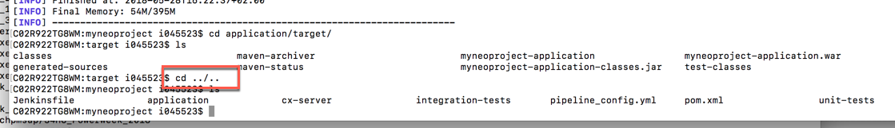
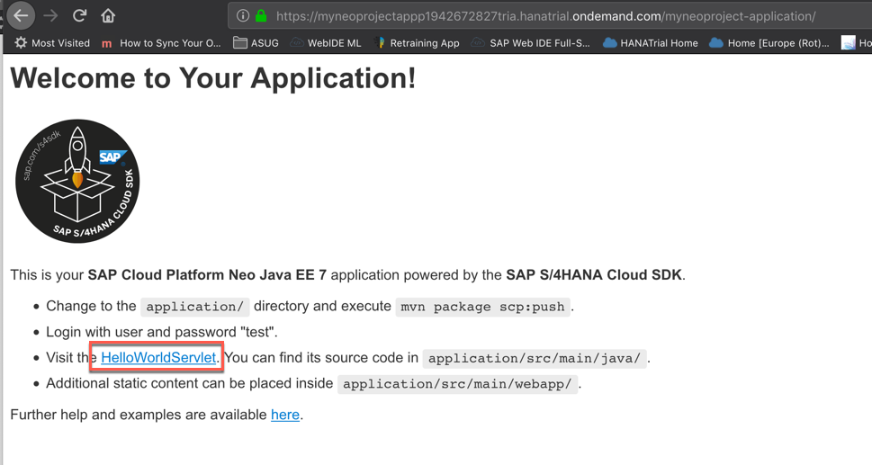

<table width=100% border=>
<tr><td colspan=2><h1>EXERCISE 21 - BUILDING A PROJECT WITH THE NEO ARCHETYPE</h1></td></tr>
<tr><td><h3>SAP Partner Workshop</h3></td><td><h1> &nbsp;30 min</h1></td></tr>
</table>


## Description
In this exercise, you’ll learn how 

* to create a SAP S/4HANA Cloud SDK project for Neo from an archetype using the Terminal window
* to build the project with Maven
* to deploy the application to your local SCP and, finally, to your real Neo stack environment

For further reading on S/4HANA Cloud SDK, click link below.
<https://www.sap.com/germany/developer/topics/s4hana-cloud-sdk.html>


## Target group

* Developers
* People interested in learning about S/4HANA extension and SDK  


## Goal

The goal of this exercise is to create a Maven project for Neo stack starting from the Neo archetype made available with the SAP S/4HANA Cloud SDK.


## Prerequisites
  
Here below are prerequisites for this exercise.

* A trial account on the SAP Cloud Platform. You can get one by registering here <https://account.hanatrial.ondemand.com>
* Apache Maven
* Java JDK 8


## Steps

1. [Create a project with the Neo archetype through the terminal](#create-a-project-with-neo)
1. [Build the project](#build-the-project)
1. [Deploy to local SCP](#deploy-to-local-scp)
1. [Test the application on local SCP](#test-on-local-scp)
1. [(Optional) Test the application on Neo](#test-on-neo)


### <a name="create-a-project-with-neo"></a> Create a project with the Neo archetype through the terminal
As a first step we are going to create a project containing all the required artifacts for S/4HANA development, through the terminal window.

1. Open your Terminal window

1. Go to the folder where you want to create this project

1. Enter the command

	```sh
	mvn archetype:generate -DarchetypeGroupId=com.sap.cloud.s4hana.archetypes -DarchetypeArtifactId=scp-neo-javaee7 -DarchetypeVersion=2.8.1
	```

1. This command is *interactive*, which means that during its execution you will receive some requests. In particular for this command you will have to enter the name of the project you want to create

1. Enter the group ID **com.sap.sample**

1. Enter the artifact ID **myneoproject**

1. Enter the version **1.0-SNAPSHOT**

1. Hit **[Enter]** to confirm the proposed package name

1. Hit **[Enter]** to confirm the creation of the project  
	

1. You will receive a success message like this  
	


### <a name="build-the-project"></a> Build the project
Now that the project is in place we can build it through a very simple Maven command.

1. After the project's creation, you should find the following folder in the directory where you executed the `archetype:generate` command  
	

1. Do 
	
	```
	cd myneoproject
	```

1. Do
 
	```
	mvn clean install
	```

1. This command will download all the required artifacts from the Maven Central repository and will build the project  
	

1. After a while you will receive a success message  
	

1. Go to the folder *application/target* with 
	
	```
	cd application/target
	```

1. Here you can see the product of this building process: the file *myneoproject-application.war*. This is the file which is going to be deployed to Neo stack  
	


### <a name="deploy-to-local-scp"></a> Deploy the application to local SCP
Before sending this package to Neo, you might want to test it locally to see if it's working fine or if it's matching all your requirements. SAP S/4HANA Cloud SDK does simplify this for you by another Maven command.

1. Using the terminal window, go back to your project's root by entering 
	
	```
	cd ../..
	```
	>NOTE: if you are on Windows the command is `cd ..\..`
	
	

1. Run the command 
	
	```sh
	mvn scp:clean scp:push -pl application
	```
	
	to push this application on the local Tomcat  
	

1. You will be requested to enter

	Parameter          |Value
	-------------------|----------------
	URL for Destination|ErpQueryEndpoint
	User               |dummy
	Password           |dummy

	> NOTE: actually, these values are not really used because you are not accessing data on any backend system  

	

1. Once the process is finished, you will receive a message saying that deployment finished successfully  
	


### <a name="test-on-local-scp"></a> Test the application on local SCP
You can test the application deployed to the local SCP.

1.  Go to <http://localhost:8080/myneoproject-application/hello> to get the "Hello World!" message. You will be prompted again to enter your username and password for accessing the CP, but you can simply put **test/test** because you have not implemented yet any kind of authentication  
	

1. Here you get the "Hello World!" message  
	

1. If you want simply to stop the server, you can run the command 
	
	```
	mvn scp:clean -pl application
	```
	
	This will stop the server and free all the allocated resources  
	
	
> NOTE: The Tomcat server will be running on port 8080. You might receive an error message, in case this port is already taken on your machine. So please verify that this port is available


### <a name="test-on-neo"></a> (Optional) Test the application on Neo
This is an optional step for this exercise. You can try to deploy this application directly on the Neo stack using the SAP Cloud Platform cockpit. 

1. Open your [SAP Cloud Platform cockpit](<https://account.hanatrial.ondemand.com/cockpit>)

1. Click on the **Neo Trial** tile
	

1. Click on the **Java Applications** on the left and then on **Deploy Application**  
	

1. Specify the path to your *.war* file, which should be under *application/target*

1. Specify an **application name** or keep the default one

1. Change the **Java Runtime Name** to be **Java EE 7 Web Profile TomEE 7**, choose **JRE 8** as JVM Version and click on **Deploy**  
	

1. The application will be deployed to Neo. After a while you should get the following message. Click on **Start**  
	

1. The application status will change to **Starting**  
	

1. After a while the application status will change again to **Started**. Click on the application's name  
	

1. The application's overview page appears. Click on the application's URL  
	

1. The Tomcat webserver installed together with your app is working fine  
	

1. By specifying, at the end of the URL the **/hello** endpoint you will get the Hello World message  
	


## Summary
This concludes the exercise. You should have learned how to create a SAP S/4HANA Cloud SDK project for Neo from an archetype using the Terminal window. You have also understood how to build the project and deploy it to the local SCP or to the real Neo stack. Please proceed with the next exercise.
