<table width=100% border=>
<tr><td colspan=2><h1>EXERCISE 22 - CREATING YOUR OWN COMMUNICATION ARRANGEMENT</h1></td></tr>
<tr><td><h3>SAP Partner Workshop</h3></td><td><h1> &nbsp;20 min</h1></td></tr>
</table>

## Description
In this exercise, you’ll learn how

* to create a Communication System along with a Communication User
* to setup a Communication Arrangement
* to test your new Communication Arrangement

## Target group

* Developers
* People interested in learning about S/4HANA extension and SDK  

## Goal

The goal of this exercise is to create a Communication System along with a Communication User and to setup a Communication Arrangement for the Product Master collection.

## Prerequisites
  
Here below are prerequisites for this exercise.

* A S/4HANA Cloud system with related credentials
* Postman for testing the service. You can download it from [here](https://www.getpostman.com)

## Steps

1. [Create a Communication User and a Communication System](#communication-system)
1. [Create a Communication Arrangement ](#communication-arragnement)
1. [Test the service](#test-the-service)

###  Create a Communication User and Communication System
In the upcoming exercises you will learn how to retrieve and work with data using the S/4HANA Cloud SDK. For this reason we want now to create our own data source so that we can improve our application built in the previous exercise making it able to connect with our S/4HANA Cloud back-end. We start creating our own Communication System. A Communication User will be created as well along with the Communication System.

1. Open the S/4HANA Cloud back-end portal by using the link provided by your instructor  
	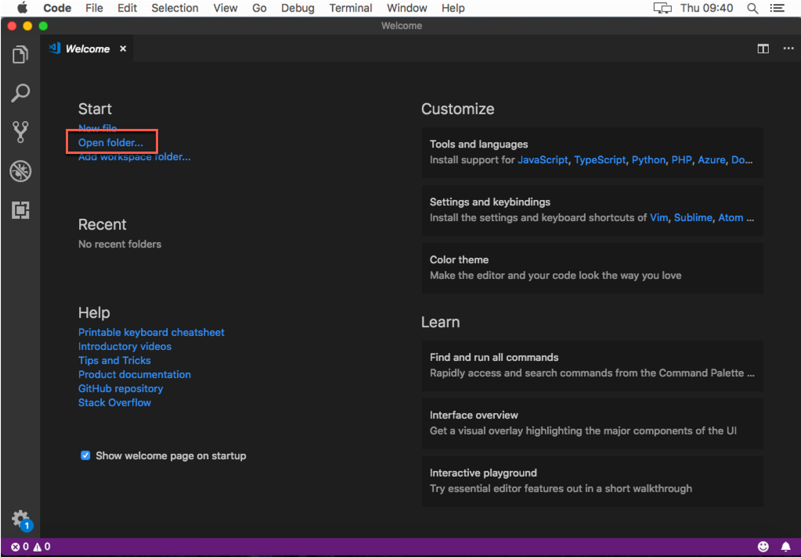

1. Click on the down arrow on the top right corner of the page and choose **Communication Management**  
	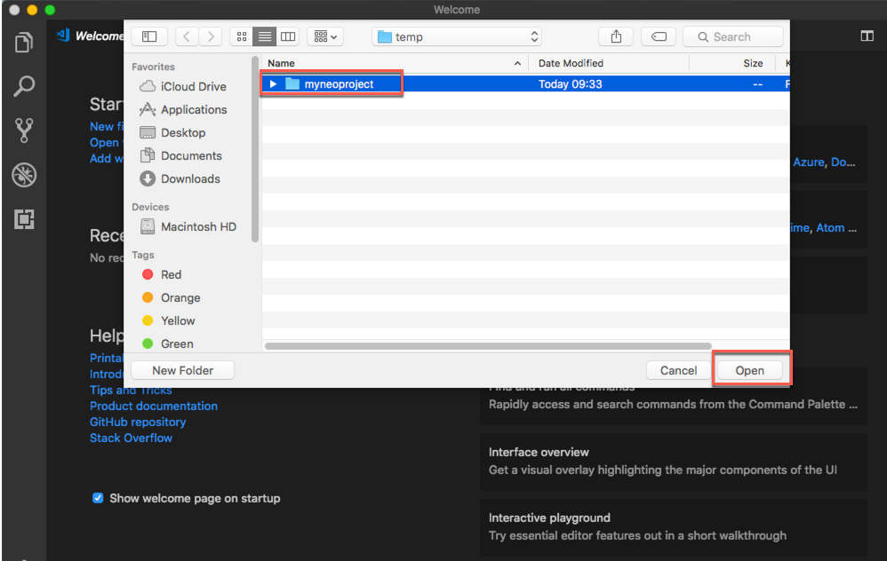

1. Select **Communication Systems**  
	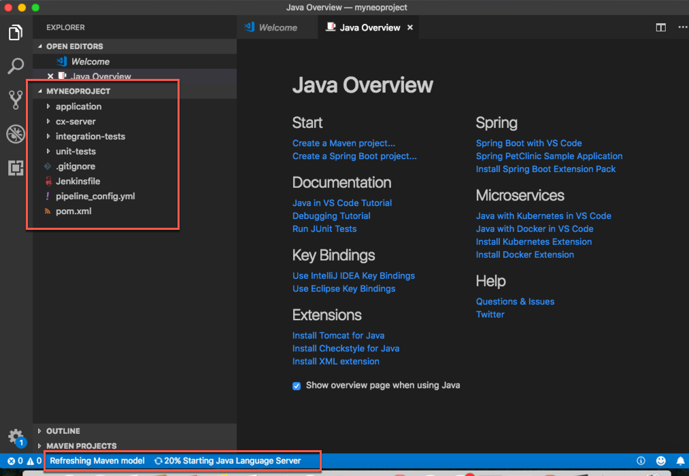

1. Click on **New** to create a new communication system  
	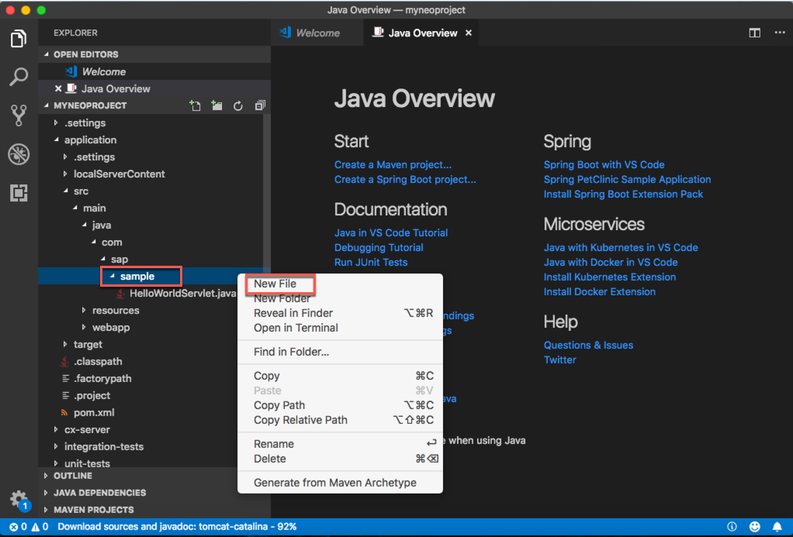

1. Enter **PROD\_CS\_\<LOC\>\_XX** for both the System ID and the System Name, replacing **\<LOC\>** with the location's acronym where you are attending the workshop (i.e. WDF for Walldorf) and **XX** with your workstation ID. Both information will be provided you by the instructor. When done click **Create**  
	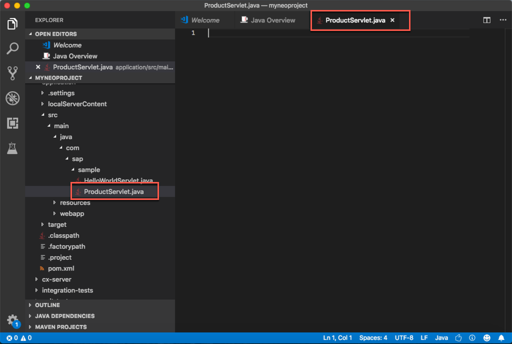

1. Enter

	| Parameter | Value |
	| --------- | ----- |
	| Host Name | localhost |
	| Logical System | LOCALHOST |
	| UI Host Name | localhost |
	| Business System | PROD\_CS\_\<LOC\>\_XX |
	
	(remember to replace **\<LOC\>** with the location's acronym where you are attending the workshop (i.e. WDF for Walldorf) and **XX** with your workstation ID)
	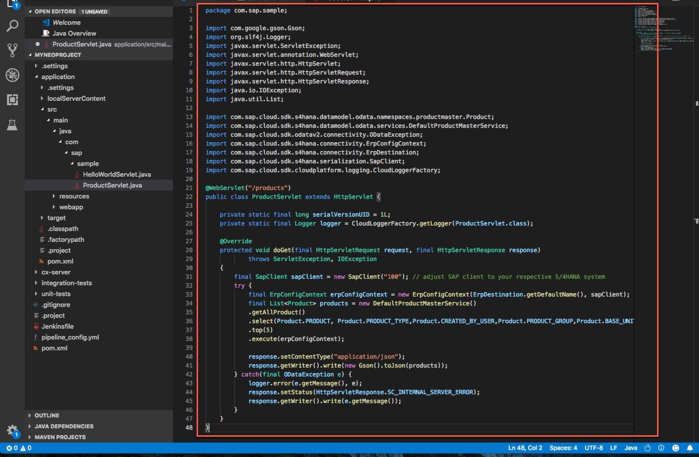

1. Scroll down the page to the **User for Inbound Connection** section and click on the **+** sign to add a new user  
	

1. Since your user is not yet present, click on **New User**  
	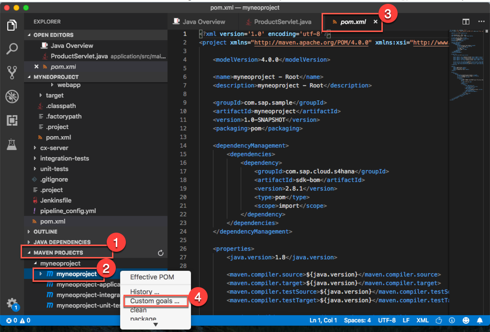

1. You are now in the page where you can create a new communication user. Enter

	| Parameter | Value |
	| --------- | ----- |
	| User Name | PROD\_CU\_\<LOC\>\_XX |
	| Description | Product Communication User \<LOC\> XX |
	| Password | A password with at least 20 chars with a upper case char,numbers and a special character (i.e. "**Welcome2thisworkshop!**") |

(where **\<LOC\>** with the location's acronym where you are attending the workshop and **XX** is your workstation ID)

Then click on the **Create** button  
	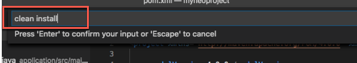

1. Your user has been created. Click on the **OK* button to use it as Inbound Communication User  
	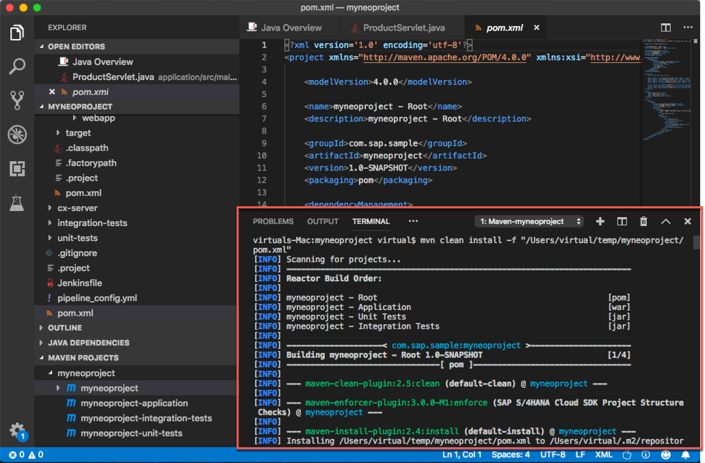

1. Your Inbound Communication User is in place. Now let's add the Outbound Communication User. Press the **+** button in the **User for Outbound Communication** section  
	

1. Enter the same user and password you created before for the Inbound Communication and keep **User Name and Password** as **Authentication Method**; then click **Create**  
	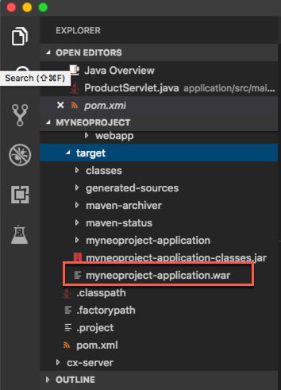

1. Both Inbound and Outbound Communication Users are in place. Click on **Save** to confirm the Communication System creation 
	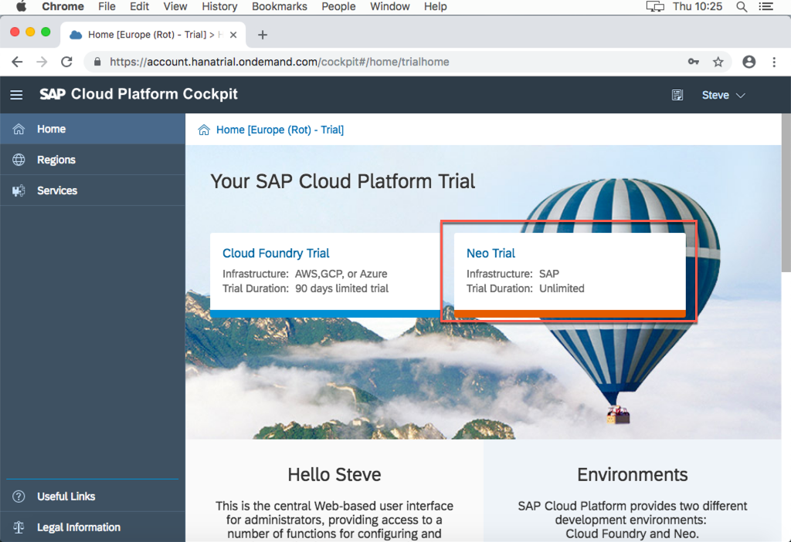

1. Click on the **Home** button to go back to the Home Page  
	

1. You have successfully created your Communication System.

###  Create a Communication Arragnement
The next step is to create a new Communication Arrangement.

1. Click on the **Communication Arrangements** tile  
	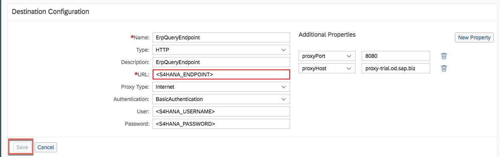

1. Click on **New**  
	

1. Browse for the existing scenarios  
	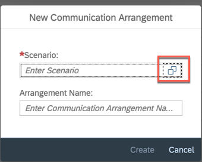

1. Select the **SAP\_COM\_0009** scenario  
	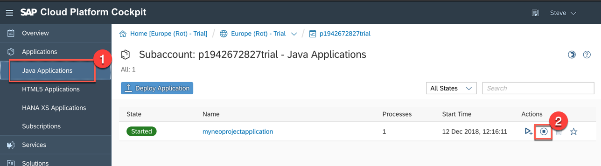

1. Enter **PROD\_CA\_\<LOC\>\_XX** as Arrangement Name replacing **\<LOC\>** with the location's acronym where you are attending the workshop and **XX** with your workstation ID; then click **Create**  
	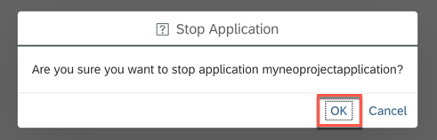

1. Browse for a Communication System    
	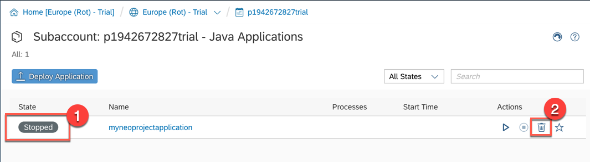

1. Select the Communication System **PROD\_CS\_\<LOC\>\_XX** you created earlier where **\<LOC\>** with the location's acronym where you are attending the workshop and **XX** is your workstation ID
	

1. The correct information is loaded automatically. 
	

1. Check that also the user name for the Outbound Communication is the correct one  
	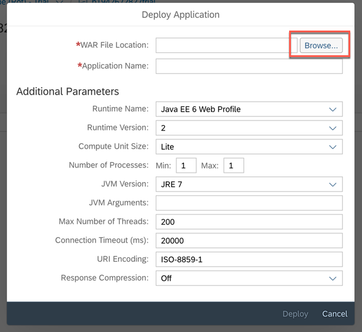

1. Expand the first outbound service **Replicate Product from S/4 System to Client** and **deactivate** it
	

1. Do the same for all the other services  
	

1. Once you have deactivated all the outbound services click on **Save** to confirm the creation of your communication arrangement  
	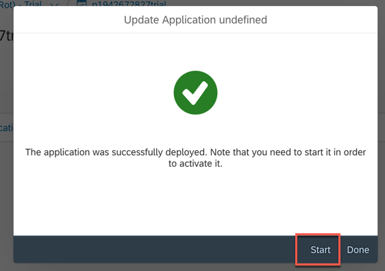

1. If you scroll a little up this page, you can find a link for the **Product Master - Create, Read, Update, Delete**: this will be the link which you need to use in the next exercises for retrieving Products data. The credentials are the Communication User you have defined here. Write down this link with its credentials because you will need them in the upcoming exercises
	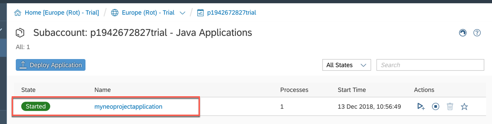

1. Click on the **Home** button to go back to the Home Page  
	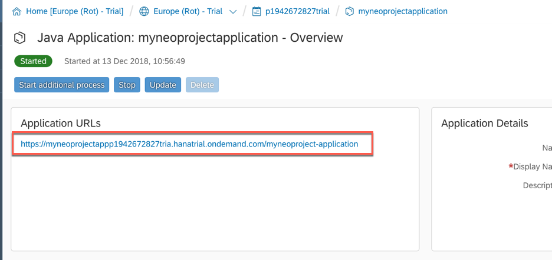

1. You have successfully created your Communication Arrangement.

###  Test the service
In order to test the service provided by your new Communication Arrangement you can put its URL in a REST client like Postman.

1. Download Postman from from [here](https://www.getpostman.com) and install it  
	

1. Open Postman and perform the following steps:
	- set **GET** as request method
	- paste the **URL** you got at the end of the previous chapter
	- click on **the Authorization tab**
	- select **Basic Auth**
	- enter your **Communication User** with its password
	- click the **Send** button
	
	You should get a screen like this where the the Response Status is **200** and a the list of all the available collections is returned. You should be also able to read collection titles like **A_Product**. This means that your service is working fine  
	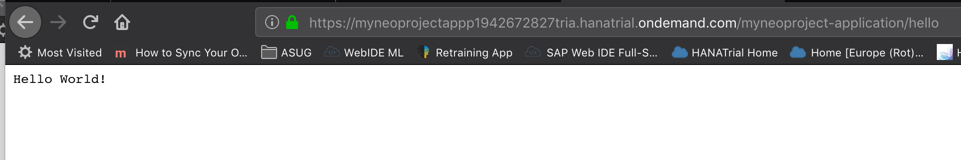

1. Congratulations! You have successfully created and tested your Communication User, System and Arrangement.

## Summary
This concludes the exercise. You should have learned how to create a Communication System along with a Communication User and how to setup your Communication Arrangement. Please proceed with the next exercise.
