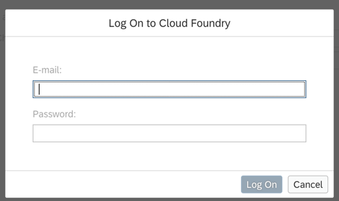
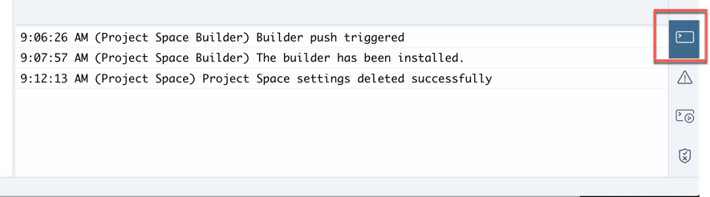
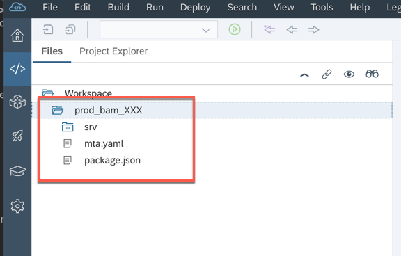
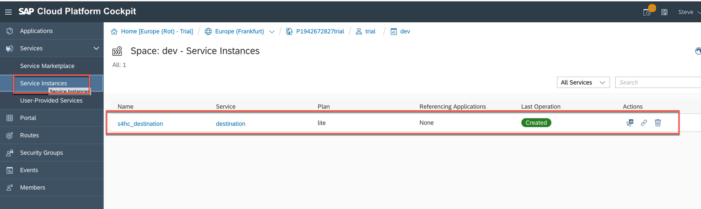
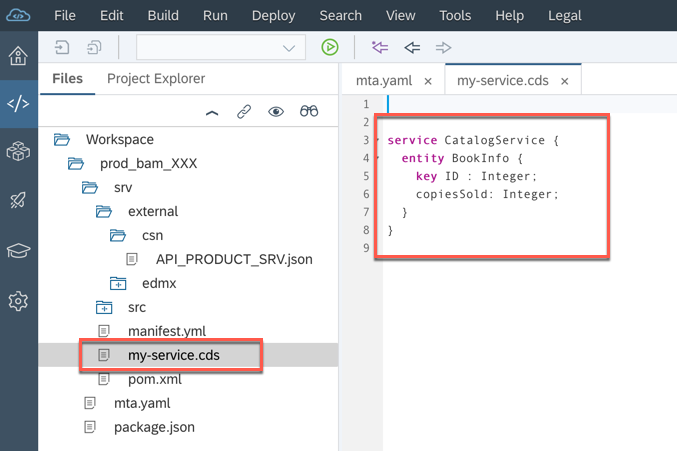

<table width=100% border=>
<tr><td colspan=2></td></tr>
<tr><td colspan=2><h1>EXERCISE 2_3 - Create a service and a front-end application using the Application Programming Model</h1></td></tr>
<tr><td><h3>SAP S/4HANA Cloud Bootcamp</h3></td><td><h1> &nbsp;50 min</h1></td></tr>
</table>

## Description
In this exercise, you’ll learn how to 

* create a new CDS service exposing data from S/4HANA Cloud using the Business Application Programming model
* create, with SAP Web IDE Full-Stack, a frontend application which consumes data from the service.


## Target group

* Developers
* People interested in learning about Application Programming Model  


## Goal

The goal of this exercise is to create a frontend application for your service using the Application Programming Model template in SAP Web IDE Full-Stack.  

## Prerequisites
  
Here below are prerequisites for this exercise.

* Previous exercises completed

## Steps

1. [Create a new application with the Programming Model template](#new-application)
1. [Integrate an external service in the project](#external-service)
1. [Create the custom CRUD classes](#crud-classes)
1. [Build and deploy the project](#build-deploy)
1. [Add some annotations to the service](#add-annotations)
1. [Create the front end application, build and deploy again](#frontend-application)


### <a name="new-application"></a>Create a new application with the Programming Model template

In this chapter you are going to see how to use SAP Web IDE to create a new application with the Application Programming Model. 

1. Access your **SAP Web IDE Full-Stack** environment using your credentials  
	

1. SAP Web IDE opens up in the browser
	>NOTE: for SAP employees it's better to use Firefox, because it's easy to bypass the SAP SSO, since we will be using different credentials  
	
	

1. Click on the small gear on the left-hand sidebar and choose **Cloud Foundry**   
	

1. In case you receive a request for authentication, enter again your SAP Cloud Platform Trial credentials  
	

1. Click on the **API Endpoint** drop down list to choose your Cloud Foundry API Endpoint. This should be the same you wrote down when you configured your Cloud Foundry space  
	

1. Select your **Organization** and **Space** and click on the button **Install Builder**. This operation will install a special app, the "Cloud Foundry Builder", into your Cloud Foundry space: this app will take care of building the *CDS* and the *.mtar* files which will be deployed to the Cloud Foundry environment   
	

1. After some time the builder will be installed as a Cloud Foundry application and you will get the message that the builder is up to date. Click on **Save**  
	

1. Go to the **Development** tab in SAP Web IDE Full-Stack and, from the **View** menu, click on the **Console** item to enable the console. This will help you to easily debug and check the status of the processes  
	

1. The console is opened at the bottom of the screen. You can also quickly disable or enable it again by simply clicking on the related button in the right hand side toolbar  
	

1. Click on **File -> New -> Project from Template**  
	

1. Under the **Featured** category select the **SAP Cloud Platform Business Application** template and click **Next**  
	

1. Enter **prod\_bam\_XXX** (where **XXX** is your workstation ID) as project name and click **Next**  
	

1. Click **Next** in this screen  
	

1. Select 


	| Parameter | Description |
	| --------- | ----------- |
	| Service Module   | **Java**        |
	| Java Package | **com.sap.sample.prod\_bam\_XXX** (where **XXX** is your workstation ID) |
	| Database Module | **not included** |
	| Include sample files in project | Enabled |
	| Enable user authentication (UAA) | Disabled |


	and click **Finish**  
	

1. Now, in the Workspace you can see your new project  
	

1. If you access your Cloud Foundry environment and go to your space...  
	

1. ... you can see that there is a new application running: that's the **Cloud Foundry Builder**  
	

1. If you click on **Service Instances** in the left-hand menu, you can see that there is one service instance (related to the "destination" service), we imported in the previous exercise  
	


### <a name="external-service"></a>Integrate an external service in the project
In our project, we want now to use an external service like the one for retrieving Products from S/4HANA Cloud. Let's see how to add this external service and how to redefine it using a CDS file.

1. First of all, go back to your SAP Web IDE and double click on the *mta.yaml* file to open it in the editor  
	

1. Replace the entire content with the following:

	```yml
	ID: prod_bam_XXX
	_schema-version: '2.1'
	version: 0.0.1
	modules:
	  - name: prod_bam_XXX-srv
	    type: java
	    path: srv
	    parameters:
	      memory: 768M
	      disk-quota: 512M
	    provides:
	      - name: srv_api
	        properties:
	          url: '${default-url}'
	    requires:
	      - name: s4hc_destination
	      - name: uaa_prod_bam
	    properties:
	      ALLOW_MOCKED_AUTH_HEADER: true
	
	resources:
	  - name: s4hc_destination
	    type: destination
	  - name: uaa_prod_bam
	    parameters:
	       service-plan: application
	       service: xsuaa
	    type: org.cloudfoundry.managed-service
	```
  	make also sure you replace the **XXX** text with your workstation ID. Then save the file.
  	Just to give you a little background to this file, here we are defining a new module named **prod\_bam\_XXX-srv** which will be your new OData service. This services requires two CF service instances: one (s4hc\_destination) for the destination to the back-end data and another (uaa\_prod\_bam) for the security management. We also increased the memory and disk quotas for this service  
	

1.  In order to include and external service in your project, right click on the *srv* folder and choose **New -> Data Model from External Service**  
	

1. Select **Service URL**, locate the destination named **ErpQueryEndpoint** (pay attention that this destination is the same we defined in the previous exercise, so it should be already in place), enter the path `/sap/opu/odata/sap/API_PRODUCT_SRV` and click on the **Test** button  
	

1.  Verify that the service is available and click on **Next**  
	

1. Deselect the **Generate Virtual Data Model classes** checkbox and click on **Finish**  
	

1. Please re-enter your Cloud Foundry credentials in case they will be requested again  
	

1. After a while your service model will be created  
	

1. You should see something like this in your SAP Web IDE  
	

1. Let's now define our Product service. Double click on the *my-service.cds* file to open it in the editor  
	

1. Replace its content with the following code and save the file. As you can see here, we are loading the service definitions from the file *./external/csn/API\_PRODUCT\_SRV*. Based on this file we are exposing several fields in our service and we are also telling to the service provider that we are going to define **custom handlers** for CRUD requests - we will see this in a bit e.g.: @Read(serviceName = "CrudService", entity = "Product") - by specifying the statement **@cds.persistence.skip**  

	```
	using API_PRODUCT_SRV as prd from './external/csn/API_PRODUCT_SRV';
	
	service CrudService {
		@cds.persistence.skip
		entity Product as projection on prd.A_ProductType {
			Product,
			ProductType,
			CreatedByUser,
			ProductGroup,
			BaseUnit,
			WeightUnit
		}
	}
	```
	

1. After a while you should receive the message **Build of "/prod_bam_XXX" completed.**  
	


### <a name="crud-classes"></a>Create the custom CRUD classes

1. Locate the *prod\_bam\_XXX* folder (where XXX is your workstation ID) under the path *prod\_bam\_XXX/srv/src/main/java/com/sap/sample/prod\_bam\_XXX* and, after right clicking on it, choose **New -> Folder**  
	

1. Create a new folder named *commands*  
	

1. Create another folder named *crud*  
	

1. This is what you should see at the end of this process  
	

1. Right click on the *commands* folder and create a new Java class by choosing **New -> Java Class**  
	

1. Name this class as *ProductReadByKeyCommand* 
	

1. Create another class in the same folder named *ProductReadCommand*  
	

1. Create another Java class under the *crud* folder  
	

1. Name this class as *ProductRead*  
	

1. This is what you should get at the end of this process  
	

1. Now, double click on the *ProductReadByKeyCommand*, replace just the class declaration with the following content and save the file (**do not touch the first line containing the package declaration**)

	```java
	import com.netflix.hystrix.exception.HystrixBadRequestException;
	import com.sap.cloud.sdk.odatav2.connectivity.ODataException;
	import com.sap.cloud.sdk.s4hana.connectivity.ErpCommand;
	import com.sap.cloud.sdk.s4hana.connectivity.ErpConfigContext;
	
	import com.sap.cloud.sdk.s4hana.datamodel.odata.namespaces.productmaster.Product;
	import com.sap.cloud.sdk.s4hana.datamodel.odata.namespaces.productmaster.ProductByKeyFluentHelper;
	import com.sap.cloud.sdk.s4hana.datamodel.odata.services.DefaultProductMasterService;
	
	public class ProductReadByKeyCommand extends ErpCommand<Product> {
		private final ErpConfigContext erpConfigContext;
		private String product;
	
		public ProductReadByKeyCommand(ErpConfigContext erpConfigContext, String product) {
			super(ProductReadByKeyCommand.class, erpConfigContext);
			this.product = product;
			this.erpConfigContext = erpConfigContext;
		}
	
		@Override
		protected Product run() {
	
			ProductByKeyFluentHelper service = new DefaultProductMasterService().getProductByKey(product);
	
			try {
				return service.execute(erpConfigContext);
			} catch (final ODataException e) {
				throw new HystrixBadRequestException(e.getMessage(), e);
			}
		}
	}
	```

	

1. Double click on the *ProductReadCommand*, replace the existing class with the following content and save the file (**do not touch the first line**)

	```java
	import com.netflix.hystrix.exception.HystrixBadRequestException;
	import com.sap.cloud.sdk.odatav2.connectivity.ODataException;
	import com.sap.cloud.sdk.s4hana.connectivity.ErpCommand;
	import com.sap.cloud.sdk.s4hana.connectivity.ErpConfigContext;
	import com.sap.cloud.sdk.s4hana.datamodel.odata.helper.Order;
	
	import com.sap.cloud.sdk.s4hana.datamodel.odata.namespaces.productmaster.Product;
	import com.sap.cloud.sdk.s4hana.datamodel.odata.namespaces.productmaster.ProductField;
	import com.sap.cloud.sdk.s4hana.datamodel.odata.namespaces.productmaster.ProductFluentHelper;
	import com.sap.cloud.sdk.s4hana.datamodel.odata.services.DefaultProductMasterService;
	import com.sap.cloud.sdk.service.prov.api.request.OrderByExpression;
	
	import java.util.*;
	
	public class ProductReadCommand extends ErpCommand<List<Product>> {
	
		private final int top;
		private final int skip;
		private final ProductField[] selectedProperties;
		private final List<OrderByExpression> orderByProperties;
		private final ErpConfigContext erpConfigContext;
	
		public ProductReadCommand(ErpConfigContext erpConfigContext, int top, int skip, List<String> properties,
				List<OrderByExpression> orderByProperties) {
			super(ProductReadCommand.class, erpConfigContext);
			this.erpConfigContext = erpConfigContext;
			this.top = top;
			this.skip = skip;
			selectedProperties = properties.stream().map(property -> new ProductField(property))
					.toArray(ProductField[]::new);
	
			this.orderByProperties = orderByProperties;
		}
	
		@Override
		protected List<Product> run() {
	
			ProductFluentHelper service = new DefaultProductMasterService().getAllProduct();
	
			orderByProperties.stream()
					.forEach(expression -> service.orderBy(new ProductField<>(expression.getOrderByProperty()),
							expression.isDescending() ? Order.DESC : Order.ASC));
	
			service.select(selectedProperties);
	
			if (skip > 0)
				service.skip(skip);
	
			if (top > 0)
				service.top(top);
	
			try {
				return service.execute(erpConfigContext);
	
			} catch (final ODataException e) {
				throw new HystrixBadRequestException(e.getMessage(), e);
			}
		}
	}
	```
	


1. Finally, double click on the *ProductRead*, replace the class with the following content **without touching the first line**, replace the **XXX** on lines 12 and 13 with your workstation ID and save the file

	```java
	import com.sap.cloud.sdk.service.prov.api.operations.Read;
	import com.sap.cloud.sdk.service.prov.api.response.ReadResponse;
	
	import org.slf4j.Logger;
	import org.slf4j.LoggerFactory;
	
	import java.util.List;
	import java.util.stream.Collectors;
	
	import com.sap.sample.prod_bam_XXX.commands.ProductReadByKeyCommand;
	import com.sap.sample.prod_bam_XXX.commands.ProductReadCommand;
	import com.sap.cloud.sdk.s4hana.connectivity.ErpConfigContext;
	import com.sap.cloud.sdk.s4hana.datamodel.odata.namespaces.productmaster.Product;
	import com.sap.cloud.sdk.service.prov.api.operations.Query;
	import com.sap.cloud.sdk.service.prov.api.request.QueryRequest;
	import com.sap.cloud.sdk.service.prov.api.request.ReadRequest;
	import com.sap.cloud.sdk.service.prov.api.response.QueryResponse;
	
	public class ProductRead {
		private final Logger logger = LoggerFactory.getLogger(this.getClass());
	
		@Read(serviceName = "CrudService", entity = "Product")
		public ReadResponse readSingleCustomerByKey(ReadRequest readRequest) {
			logger.debug("Received the following keys: {} ", readRequest.getKeys().entrySet().stream()
					.map(x -> x.getKey() + ":" + x.getValue()).collect(Collectors.joining(" | ")));
	
			String id = String.valueOf(readRequest.getKeys().get("Product"));
	
			Product product = new ProductReadByKeyCommand(new ErpConfigContext("ErpQueryEndpoint"), id).execute();
	
			ReadResponse readResponse = ReadResponse.setSuccess().setData(product).response();
	
			return readResponse;
		}
	
		@Query(serviceName = "CrudService", entity = "Product")
		public QueryResponse queryCustomers(QueryRequest qryRequest) {
	
			List<Product> products = new ProductReadCommand(new ErpConfigContext("ErpQueryEndpoint"),
					qryRequest.getTopOptionValue(), qryRequest.getSkipOptionValue(), qryRequest.getSelectProperties(),
					qryRequest.getOrderByProperties()).execute();
	
			QueryResponse queryResponse = QueryResponse.setSuccess().setData(products).response();
			return queryResponse;
		}
	}
	```

	


### <a name="build-deploy"></a>Build and deploy the project
1. We can build the project. Right click on the project name and choose **Build -> Build**  
	

1. After a while, you should receive a "BUILD SUCCESS" message. Also, a new folder named *mta_archives* should be available in the project explorer of your SAP Web IDE Full-Stack  
	

1. Right click on the *prod\_bam\_XXX\_0.0.1.mtar* package located under this folder and choose **Deploy -> Deploy to SAP Cloud Platform** (where XXX is your workstation ID)  
	

1. Enter your **Cloud Foundry API Endpoint** with your credentials and click **Deploy**  
	

1. After a few minutes the deployment ends and you should receive a message with a button to go straight to the service. Click on the **Open** button  
	

1. A new browser page opens up, showing the content of this service. It reports all the available OData Endpoints. For this service we have just one: click on its link  
	

1. The endpoint is reached and its definition is shown  
	

1. If you append the "/Product" entity name to this OData Endpoint you will get the list of all available products coming from the service
	> NOTE: This screenshot has been taken on Google Chrome, because it better shows the OData feed in the XML format  
	

1. Looking at your Cloud Foundry cockpit now, you should find a new **prod\_bam\_XXX-srv** application listed 
	

1. Switching to the **Service instances** you should find two more instances: one named **prodbamXXX-uaaprodbam-P\<user\>-\<random_characters\>** and another named **uaa\_prod\_bam**. The first one has been automatically generated by the creation of the Data Model from External Service; the second one is the one we defined in the *mta.yaml* file. Please delete the both service instances because the first one is not needed and the second one will be recreated with some further required parameters for the front-end application in the next chapter  
	

1. This is what you should have at the end of the process
	


### <a name="add-annotations"></a>Add some annotations to the service
1. Before we create our frontend application with the List Report template, we want to create some OData annotations directly on the main service. To do this, right click on the *srv* folder and choose **New -> File**  
	

1. Enter *main-annotations.cds* as the name for this new file and click **OK**  
	

1. Enter the following content for this file and save it. Saving this file will automatically trigger a build phase where the annotation file will be parsed and applied to the service

	```
	using CrudService as cs from './my-service.cds';
	
	annotate cs.Product with @(
		UI: {
			LineItem: [ 
				{$Type: 'UI.DataField', Value: Product, "@UI.Importance": #High},
				{$Type: 'UI.DataField', Value: ProductType, "@UI.Importance": #High},
				{$Type: 'UI.DataField', Value: CreatedByUser, "@UI.Importance": #High},
				{$Type: 'UI.DataField', Value: BaseUnit, "@UI.Importance": #High}
			],
			DataPoint#DPGroup: {
				Value: ProductGroup,
				Title: 'Group'
			},
			HeaderInfo: {
				TypeName: 'Product',
				TypeNamePlural: 'Products',
				Title: { Value: Product },
				Description: { Value: Product }
			}
		}
	);
	```
	

1. At the end of the process you will get a message informing you that the project has been successfully rebuilt  
	


### <a name="frontend-application"></a>Create the front end application, build and deploy again

1. Now let's create our frontend application. Right click on the *prod\_bam\_XXX* project and choose **New -> HTML5 Module**  
	

1. Under the **Featured** category, choose the **List Report Application** template and click **Next**  
	

1. Enter **frontend\_XXX** (where **XXX** is your workstation ID) for the **Module Name** and **frontend** for the **Title** and click **Next**  
	

1. Select **Current Project** as the data source and check that you are able to see the **CrudService** you defined earlier. Then click **Next**  
	

1. Click **Next**  
	

1. Choose **Product** as OData Collection and click **Finish**  
	

1. This is what you should get at the end  
	

1. Open the *mta.yaml* file in the editor and do the following changes

	- in the frontend section, increase both **disk-quota** and **memory** to **1024M**
	- add a new destination in the requires section of the frontend module named **uaa\_prod\_bam**
	- add a new parameter for resource uaa_prod_bam like this `path: ./xs-security.json`
	
	save the file
	
	

1. Let's build the project again. Right click on the project's name and choose **Build -> Build**  
	

1. The build phase should end successfully  
	

1. Right click on the *mtar* file in the *mta\_archives/prod\_bam\_XXX* folder and choose **Deploy -> Deploy to SAP Cloud Platform**  
	

1. Choose the right Cloud Foundry API Endpoint together with the Organization and the Space and click **Deploy**  
	

1. After some minutes the deployment ends and you get the chance to open the just deployed frontend application directly from SAP Web IDE. Click on the **Open** button for the **frontend\_XXX** application  
	

1. The frontend application is opened. Enter your SAP Cloud Platform credentials and click **Log On**  
	

1. The launch pad is shown. Click on the **frontend\_XXX** tile (where XXX is your workstation ID) tile  
	

1. The List Report application is launched. Notice that you can already see in the list header the three fields we defined in the annotation file earlier. Click on **Go**  
	

1. The list of products is shown  
	

1. If you just click on one of those records you can get the detail fields coming from the annotation file     
	

1. Congratulations! You have successfully completed the exercise.


## Summary
This concludes the exercise. You should have learned how to create a new application with the Application Programming Model template in SAP Web IDE Full-Stack and how to create in the same project a frontend application to consume your product service. Please proceed with the next exercise.
