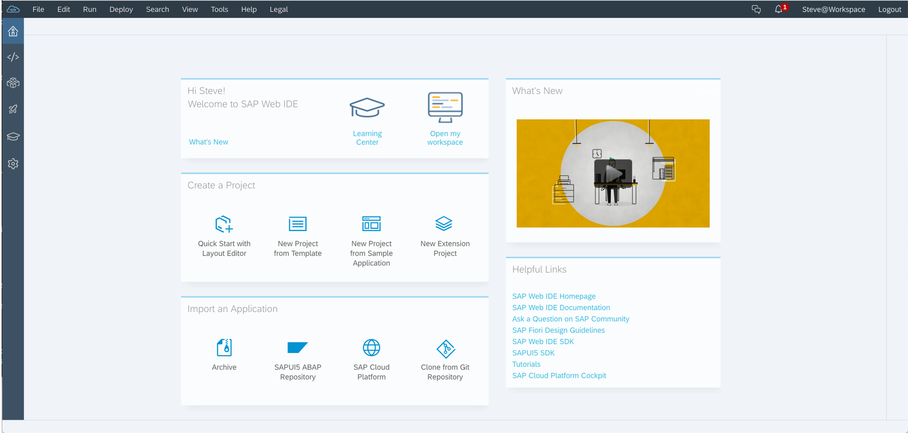
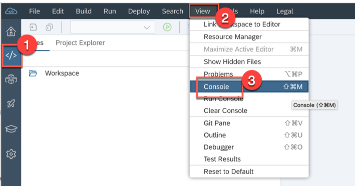
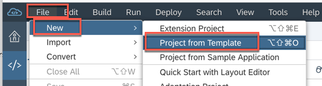
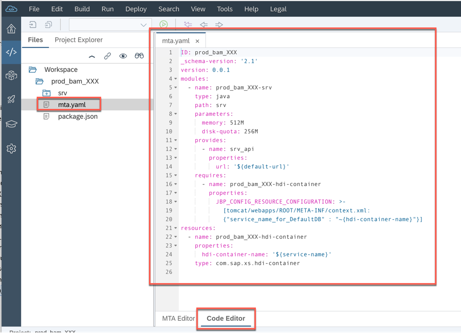
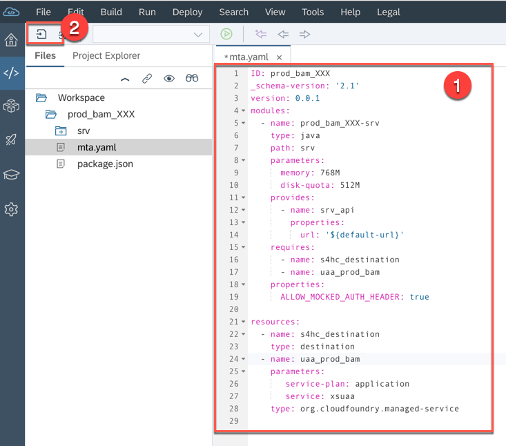
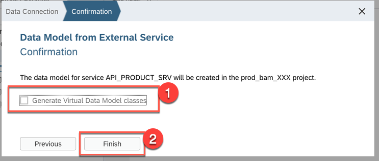
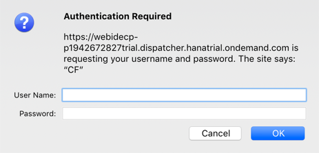
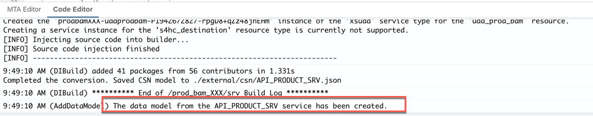

<table width=100% border=>
<tr><td colspan=2><h1>EXERCISE 23 - RETRIEVING DATA FROM S/4HANA CLOUD SYSTEM AND DEPLOYING TO NEO</h1></td></tr>
<tr><td><h3>SAP Partner Workshop</h3></td><td><h1> &nbsp;30 min</h1></td></tr>
</table>


## Description
In this exercise, you’ll learn how 

* to retrieve the list of Products from a S/4HANA back-end by using the Virtual Data Model(VDM) provided by the S/4HANA Cloud SDK framework 
* Deploy to SAP Cloud Platform Neo Trial Account and configure needed destination.

For further reading on S/4HANA Cloud SDK, click link below.
<https://www.sap.com/germany/developer/topics/s4hana-cloud-sdk.html>


## Target group

* Developers
* People interested in learning about S/4HANA extension and SDK  


## Goal

The goal of this exercise is to retrieve some products data from the S/4HANA Cloud back-end using the S/4HANA Cloud SDK and run it the application on the Neo environment.


## Prerequisites
  
Here below are prerequisites for this exercise.

* A trial account on the SAP Cloud Platform Neo. You can get one by registering here <https://cloudplatform.sap.com>
* Apache Maven
* Java JDK 8
* You finished the first Neo exercise (2_1)
* A S/4HANA system with a working communication arrangment for the Products collection


## Steps

1. [Open your project in Visual Studio Code](#vscode)
1. [Retrieve Product data from S/4HANA](#retrieve-product-data)
1. [Configure a required destination](#destination)
1. [Deploy your application to Neo and run it](#application)


### <a name="vscode"></a>Open your project in Visual Studio Code
In this section you will open your project created in Exercise 2_1 into Visual Studio Code (you should have this already installed in the prerequisites).

1. Open Visual Studio Code

1. From the Welcome page select **Open Folder...**  
	

1. Open the project you have created in the exercise 2_1  
	

1. The project is loaded into the Visual Studio Code Explorer. In the meantime all the project's artifacts are downloaded in the background as you can see from the status bar.  
	


### <a name="retrieve-product-data"></a> Retrieve Product data from S/4HANA
In this chapter you are going to see how create a new servlet to retrieve Products data from a S/4HANA Cloud system.

1. In the Visual Studio Code Explorer locate the folder *application/src/main/java/com/sap/sample*, right click on it and choose **New File**  
	

1. Name the file *ProductServlet.java*: it will be opened in the editor. At the moment it's empty, but we are going to fill it with a new servlet code to retrieve the products from the S/4HANA Cloud back-end  
	

1. Enter the following code in the editor for the *ProductServlet.java* file

	```java
	package com.sap.sample;
	
	import com.google.gson.Gson;
	import org.slf4j.Logger;
	import javax.servlet.ServletException;
	import javax.servlet.annotation.WebServlet;
	import javax.servlet.http.HttpServlet;
	import javax.servlet.http.HttpServletRequest;
	import javax.servlet.http.HttpServletResponse;
	import java.io.IOException;
	import java.util.List;
	
	import com.sap.cloud.sdk.s4hana.datamodel.odata.namespaces.productmaster.Product;
	import com.sap.cloud.sdk.s4hana.datamodel.odata.services.DefaultProductMasterService;
	import com.sap.cloud.sdk.odatav2.connectivity.ODataException;
	import com.sap.cloud.sdk.s4hana.connectivity.ErpConfigContext;
	import com.sap.cloud.sdk.s4hana.connectivity.ErpDestination;
	import com.sap.cloud.sdk.s4hana.serialization.SapClient;
	import com.sap.cloud.sdk.cloudplatform.logging.CloudLoggerFactory;
	
	@WebServlet("/products")
	public class ProductServlet extends HttpServlet {
	
	    private static final long serialVersionUID = 1L;
	    private static final Logger logger = CloudLoggerFactory.getLogger(ProductServlet.class);
	
	    @Override
	    protected void doGet(final HttpServletRequest request, final HttpServletResponse response)
	            throws ServletException, IOException
	    {
	        final SapClient sapClient = new SapClient("100"); // adjust SAP client to your respective S/4HANA system
	        try {
	            final ErpConfigContext erpConfigContext = new ErpConfigContext(ErpDestination.getDefaultName(), sapClient);
	            final List<Product> products = new DefaultProductMasterService()
	            .getAllProduct()
	            .select(Product.PRODUCT, Product.PRODUCT_TYPE,Product.CREATED_BY_USER,Product.PRODUCT_GROUP,Product.BASE_UNIT,Product.WEIGHT_UNIT)
	            .top(5)
	            .execute(erpConfigContext);
	    
	            response.setContentType("application/json");
	            response.getWriter().write(new Gson().toJson(products));
	        } catch(final ODataException e) {
	            logger.error(e.getMessage(), e);
	            response.setStatus(HttpServletResponse.SC_INTERNAL_SERVER_ERROR);
	            response.getWriter().write(e.getMessage());
	        }
	    }
	}
	```
	Let me give a short explanation to this code:
	- line 1: we declared the name of the package
	- lines 3-19: we import the required classes. Pay attention to the lines 13 and 14: it's there that we are importing the S/4HANA Cloud SDK to use the classes for Products retrieval
	- line 21: we declare the name of the servlet
	- line 33: we are preparing a specific context for the Products using the default destination name, which is "ErpQueryEndpoint"
	- lines 34-38: this is the part where we tell the servlet to retrieve the top first 5 products from the backend, selecting only a few fields from the backend (PRODUCT, PRODUCT\_TYPE, CREATED\_BY\_USER, PRODUCT\_GROUP, BASE\_UNIT, WEIGHT\_UNIT)
	- lines 40-41: we print out the response

	

1. Click on **File --> Save** to save the file  
	

1. We are ready to build the project to include this new servlet. On the right side, expand the **Maven Projects** section, select the *myneoproject* POM file (it will be opened automatically in the editor), right click on it and choose **Custom Goals...**  
	

1. Type in "**clean install**" and hit **Enter**. We are building the project directly from the development environment and not from the Terminal as we have done earlier  
	

1. The build process starts  
	

1. After a while, you should receive a **BUILD SUCCESS** message  
	

1. You can check that the resulting *war* file is available in the *target* folder  
	


### <a name="destination"></a> Configure a required destination
In this step you will be guided through configuring the needed destination for your application.

1. Go to your **SAP CP Cockpit** and navigate to your **Neo Trial** environment     
	

1. Expand **Connectivity -> Destinations** and click on **New Destination**  
	

1. Enter the following values:

	| Parameter | Value |
	| --------- | ----- |
	| Name | ErpQueryEndpoint |
	| Type | HTTP |
	| Description | ErpQueryEndpoint |
	| URL | \<S4HANA\_ENDPOINT\> |
	| Proxy Type | Internet |
	| Authentication | BasicAuthentication |
	| User | \<S4HANA\_USERNAME\> |
	| Password | \<S4HANA\_PASSWORD\> |
	
	Add the following proxy properties to the destination by click the **New Property** button. 

	>Note: these properties are only required on the Neo Trial so that it can reach the S/4HANA Cloud data center.

	| Property | Value |
	| --------- | ----- |
	| proxyHost | proxy-trial.od.sap.biz |
	| proxyPort | 8080 |
	
	At the end save the destination 
	
	
1. You can also check that the destination is working by clicking on the **Check Connection** button  
	

1. The response should be "302: Redirect". Click on **Close**  
	


### <a name="application"></a> Deploy your application to Neo and run it
Let's deploy the application to Neo and run it.

1. In your SAP Cloud Platform cockpit, on the left side, click on **Java Applications**. You should find the old application you already deployed in the exercise 2_1. Stop the application  
	

1. Click **OK** to confirm the operation  
	

1. Once the application is stopped, delete it  
	

1. Click **OK** to confirm the deletion  
	

1. Click on **Deploy Application**  
	

1. Click on **Browse...**  
	

1. Load the **myneoproject-application.war** file you can find in the *target* folder  
	

1. Specify the **Java EE 7 Web Profile TomEE 7** and click **Deploy**  
	

1. After deployment clicl on **Start**  
	

1.Once the application is started, click on the name of the application  
	

1. Click on the Application URL  
	

1. The application is opened. To go to the HelloWorldServlet you just need to click on the "HelloWorldServlet" link on this page  
	

1. The "Hello World" page is shown  
	

1. But we want to use another servlet, the one we just created, named "/products". So what we need is just to replace the "/hello" endpoint with "/products" and you should get the list of the first 5 products as we have specified in the code  
	

1. Congratulations! You have successfully retrieved a list of Products from a S/4HANA Cloud back-end using the S/4HANA Cloud SDK.


## Summary
This concludes the exercise. You have now learned you can use Cloud Foundry on Neo with the S/4HANA Cloud SDK.
