<table width=100% border=>
<tr><td colspan=2><h1>EXERCISE 23 - RETRIEVING DATA FROM S/4HANA CLOUD SYSTEM AND DEPLOYING TO NEO</h1></td></tr>
<tr><td><h3>SAP Partner Workshop</h3></td><td><h1> &nbsp;30 min</h1></td></tr>
</table>


## Description
In this exercise, you’ll learn how 

* to retrieve the list of Business Partners from a S/4HANA back-end by adding a couple of new Java classes to the application which will be consuming the S/4HANA Cloud SDK framework 
* Deploy to SAP Cloud Platform Neo Trial Account and configure needed destination.

For further reading on S/4HANA Cloud SDK, click link below.
<https://www.sap.com/germany/developer/topics/s4hana-cloud-sdk.html>


## Target group

* Developers
* People interested in learning about S/4HANA extension and SDK  


## Goal

The goal of this exercise is to retrieve some business partners data from the S/4HANA Cloud back-end using the S/4HANA Cloud SDK and run it the application on the Neo environment.


## Prerequisites
  
Here below are prerequisites for this exercise.

* A trial account on the SAP Cloud Platform Neo. You can get one by registering here <https://account.hanatrial.ondemand.com>
* Apache Maven
* Java JDK 8
* The source code created in the previous exercise
* A S/4HANA system with a working communication arrangment for the Business Partners collection
* You finished the first Neo exercise (2_1)


## Steps

1. [Import Neo Project into Eclipse](#eclipse_import)
1. [Retrieve Business Partner data from S/4HANA](#retrieve-bp-data)
1. [Deploy your application to Neo and configure the Destination](#destination)


### <a name="eclipse_import"></a> Import Neo Project into Eclipse
In this section you will import the Neo Project you created in Exercise 2_1 into eclipse.

1. Open Eclipse IDE

1. From the top menu select **File -> Import...**

1. In the popup window select **Maven -> Existing Maven Projects** and click **Next**  
	

1. Browse to the root folder where you created your Neo application earlier, you should see something similar to the below image and click **Finish**   
	

1. The maven project will be imported:  
	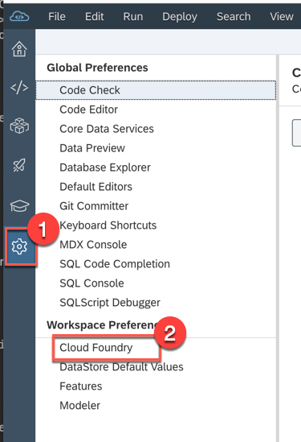


### <a name="retrieve-bp-data"></a> Retrieve Business Partner data from S/4HANA
In this chapter you are going to see how to implement a couple of new JAVA classes to retrieve Business Partners data from a S/4HANA Cloud system.


1. Double click on the *pom.xml* file in the **application** module to open it  
	

1. Select the **pom.xml** tab, paste the following **dependency** into this file, i.e. just at the end of other dependencies, and **save** the file

	```xml
	<dependency>
		<groupId>org.projectlombok</groupId>
	   <artifactId>lombok</artifactId>
	</dependency>
	```

	

1. Select both *BPDetails.java* and *BPServlet.java* you created in the Cloud Foundry application in the last exercise, right click on them and choose **Copy**   
	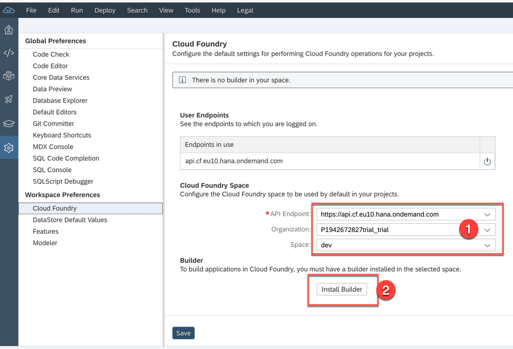

1. Paste the copied files into your Neo Application Project  
	

1. You should see the classes now in the Neo application project under the path *Java Resources->src/main/java/->com.sap.sample*  
	

1. Expand the **root** module of your Neo project and right click on the *pom.xml* file. In the context menu select **Run As -> Maven Build**  
	

1. Specify the **clean install** goals if required and click **Run**  
	

1. Building phase should end with a **BUILD SUCCESS** message  
	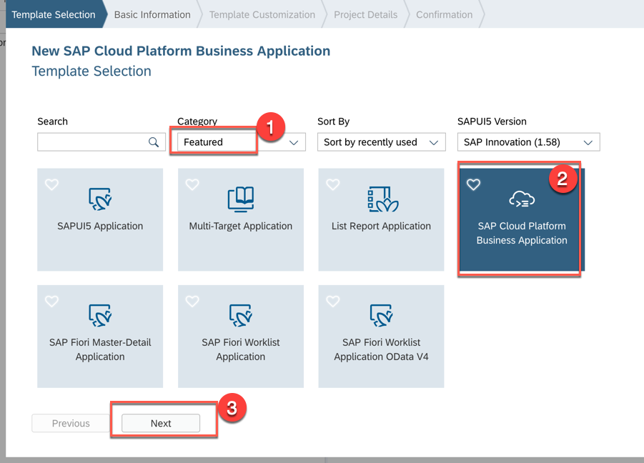


### <a name="destination"></a> Deploy your application to Neo and configure the Destination
In this step you will be guided through deploying the application to your Neo Trial account and the configuring the needed destination.

1. Go to your **SAP CP Cockpit** and navigate to your Neo Trial environment     
	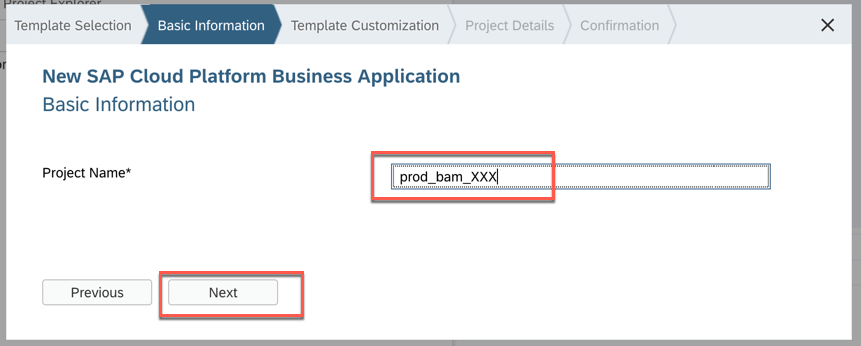

1. Click on **Java Applications** and stop your existing **myneoprojectapplication** if already existing  
	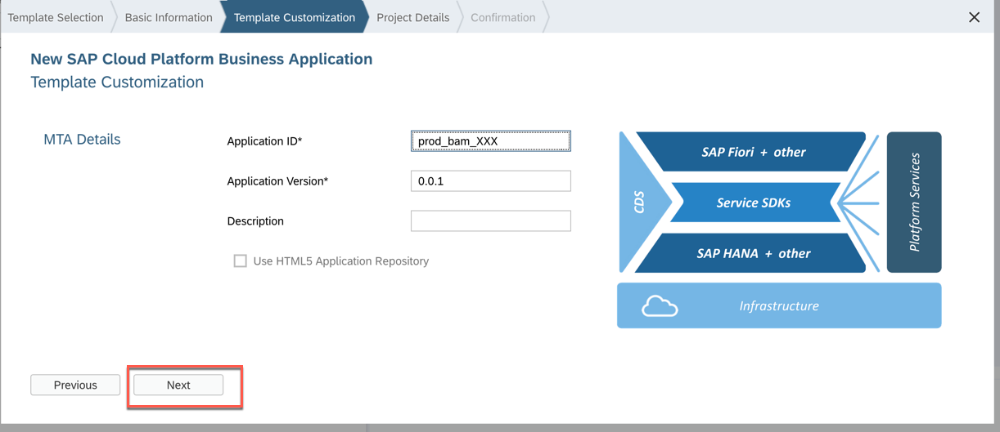

1. Once stopped, delete the application  
	

1. Click the **Deploy Application** button   
	

1. Click on **Browse...**    
	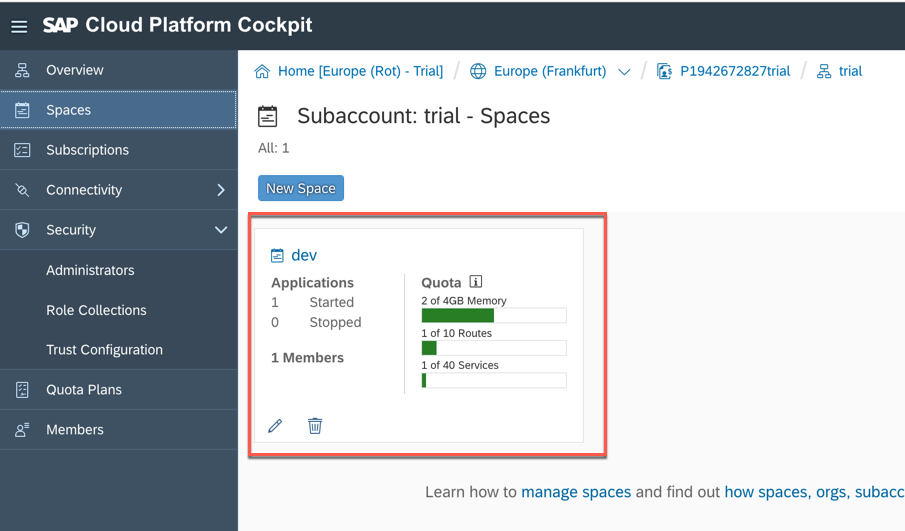
	
1. Take the file *myneoproject-application.war* you can find under the path *myneoproject/application/target/*  
	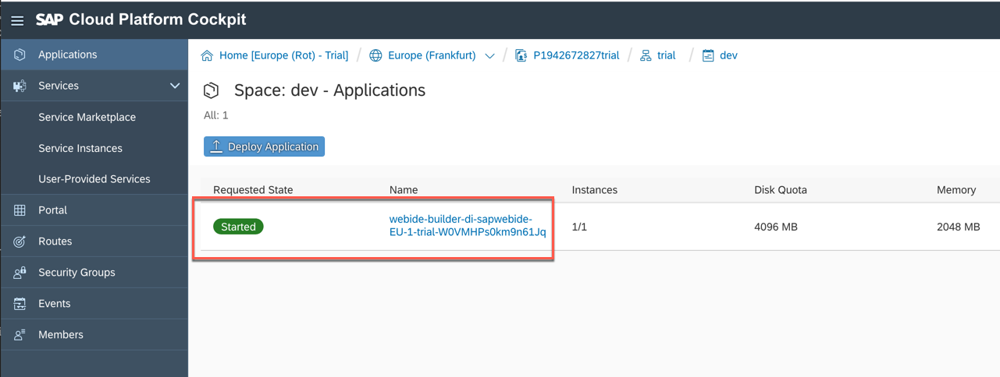

1. Select **Java EE Web Profile TomEE 7** as Runtime Name, selecct **JRE 8** as JVM Version and click **Deploy**  
	
	
1. Once your application is deployed click on **Start**  
	

1. After some time the application starts  
	

1. Click on **Connectivity->Destinations** on the left side menu  
	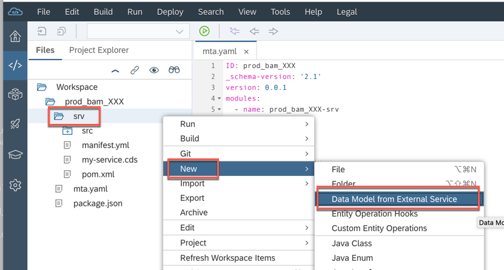

1. Click the **New Destination** button  
	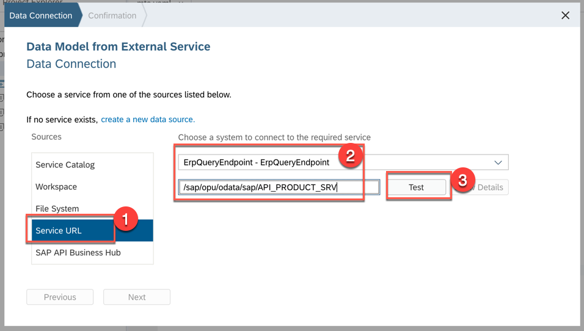

1. Enter the following values:

	| Parameter | Value |
	| --------- | ----- |
	| Name | ErpQueryEndpoint |
	| Type | HTTP |
	| Description | ErpQueryEndpoint |
	| URL | \<S4HANA\_ENDPOINT\> |
	| Proxy Type | Internet |
	| Authentication | BasicAuthentication |
	| User | \<S4HANA\_USERNAME\> |
	| Password | \<S4HANA\_PASSWORD\> |
	
1. Add the following proxy properties to the destination by click the **New Property** button. 

	>Note: these properties are only required on the Neo Trial so that it can reach the S/4HANA Cloud data center.

	| Property | Value |
	| --------- | ----- |
	| proxyHost | proxy-trial.od.sap.biz |
	| proxyPort | 8080 |
	
1. Save your Destination  
	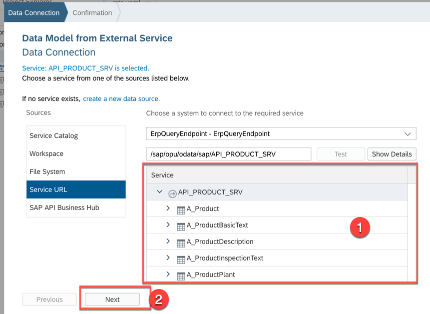
	
1. Go back to your Java application you deployed earlier and select it to go to the details  
	

1. Click the application url to launch the application  
	
	
1. You will get the following page  
	

1. Add **/businesspartners** to the end of the URL in the browser: your S/4HANA Cloud data should be displayed.  
	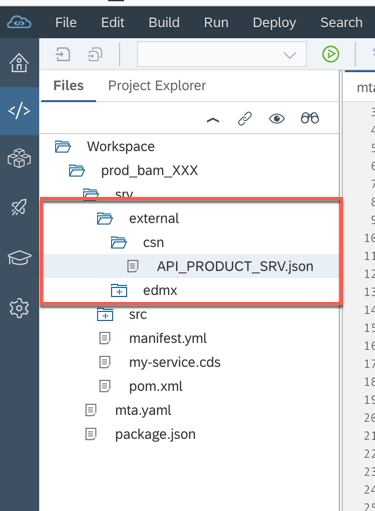


## Summary
This concludes the exercise. You have now learned you can use Cloud Foundry on Neo with the S/4HANA Cloud SDK.
