<table width=100% border=>
<tr><td colspan=2></td></tr>
<tr><td colspan=2><h1>EXERCISE 24 - Create service destinations on both SAP Cloud Platform Neo and Cloud Foundry environments</h1></td></tr>
<tr><td><h3>ASUG PreConference 2018</h3></td><td><h1> &nbsp;10 min</h1></td></tr>
</table>

## Description
In this exercise, you’ll learn how to 

* access SAP Cloud Platform NEO and Cloud Foundry environments
* create a Destination service instance in SAP Cloud Foundry and import the required destination 

## Target group

* Developers
* People interested in learning the SAP Cloud Platform Application Programming Model  

## Goal

The goal of this document is to set up some required services for the next exercises.  

## Prerequisites
  
Here below are prerequisites for this exercise.

* An account on the SAP Cloud Platform: it will be provided by your instructor along with the required credentials
* The destination file you can download [here](files/ErpQueryEndpoint_CF.zip). Extract it in a proper location on your disk

## Steps

1. [Create the destination services on SAP CF and check the Neo environemnt](#bpr-destination)
1. [Check the Neo environemnt](#neo-environment)

### Create the destination services on SAP CF and check the Neo environment
In this chapter you are going to see how to create an instance of the destination service on SAP Cloud Foundry and how to import a destination file into it.

1. Login to SAP Cloud Platform <https://account.hana.ondemand.com/cockpit#/globalaccount/8fd39023-a237-4d71-9b6a-ed9d1719d275/subaccount/1d4a4a5d-2ada-4584-9c6a-631cb5fa80f2/spaces> with the credentials provided by your instructor 
	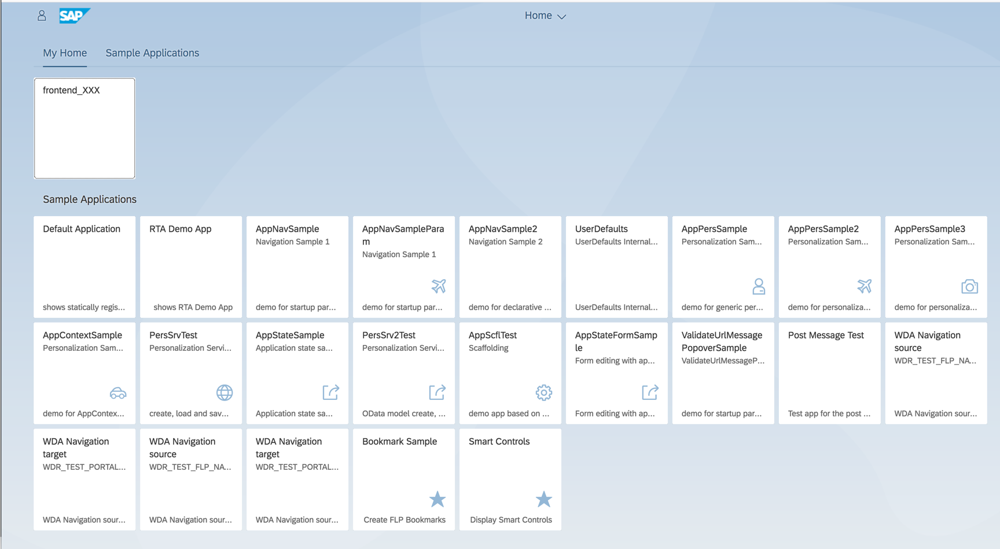

1. You will find a SAP Cloud Foundry subaccount prepared for you with a space named **ASUGCF_DevXXX** where XXX is your workstation ID. Click on the **ASUGCF** link on the top of the page to go to the subaccount's details  
	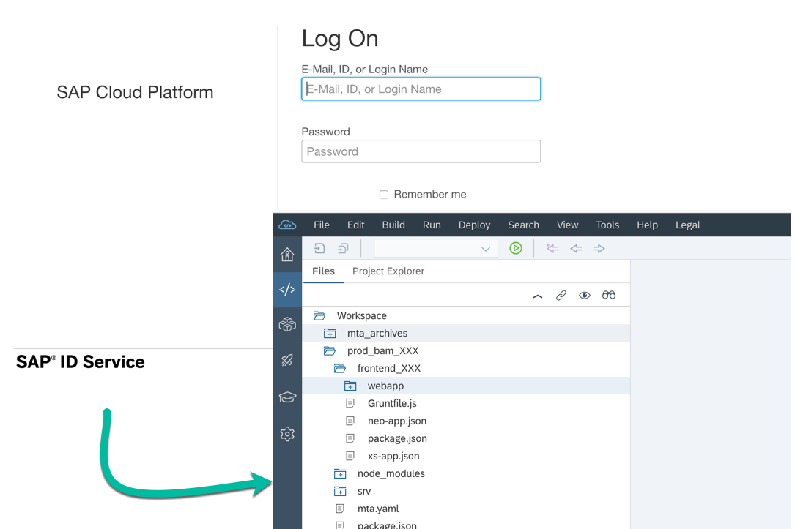

1. Take note of the **API Endpoint** you find on the right side because it will be required in the next exercises when we will ask you to specify your SAP Cloud Foundry API Endpoint and click on the **Spaces** number, just above the API Endpoint    
	

1. You are now into your space. It should be empty: if not, please feel free to delete any application you find  
	

1. Click on the **Service Marketplace** and then on the **destination** tile to create an instance of the **destination** service  
	

1. Click on **Instances** and then on **New Instance**  
	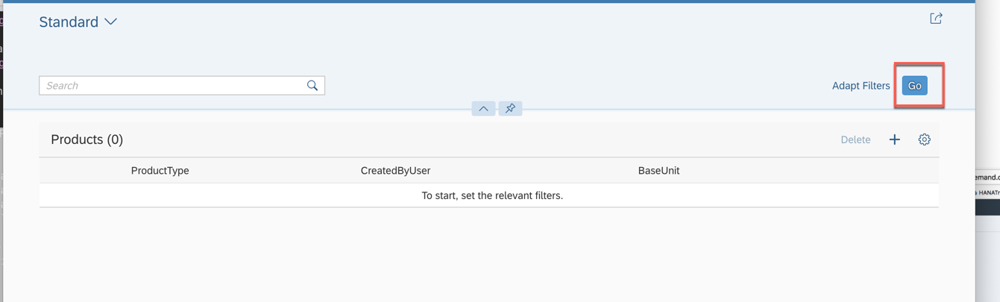

1. Choose the **lite** plan and click **Next**  
	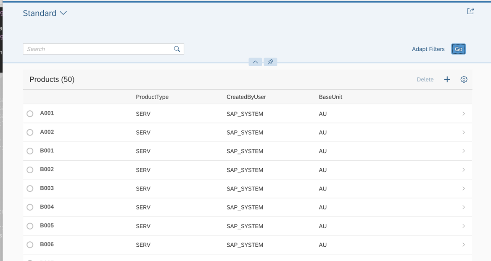

1. Click **Next**  
	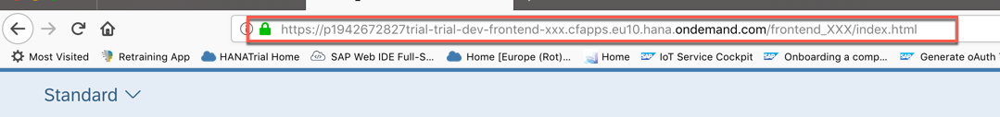

1. Don't select any application for the moment and click **Next** again  
	

1. Enter **bpr_destination** as the instance name and click **Finish**  
	

1. Your **bpr_destination** instance has been successfully created. Click on the name of this instance  
	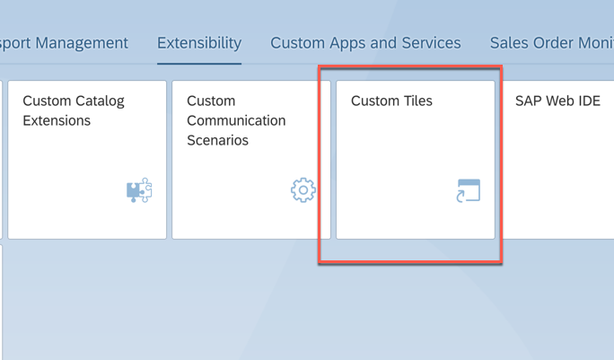

1. Select the **Destinations** tab on the left hand side and click on **Import Destination**  
	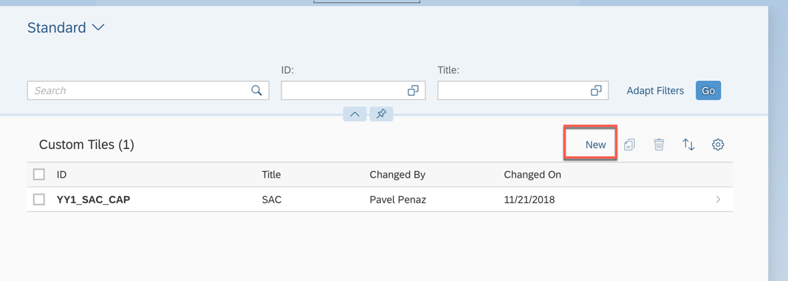

1. Locate the file *ErpQueryEndpoint_CF* you extracted from the zip downloaded in the prerequisites to this exercise  
	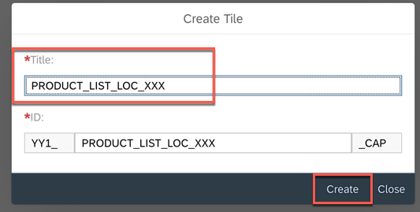

1. The file will be imported. Just enter the credentials provided by your instructor and click **Save**  
	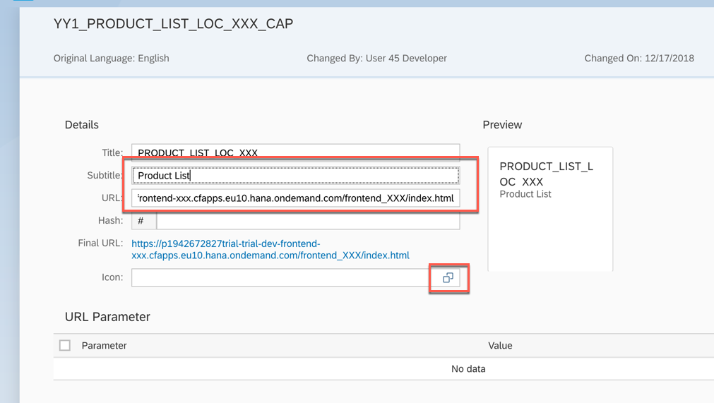

1. After saving, you can check the new destination by clicking on the button **Check Connection**  
	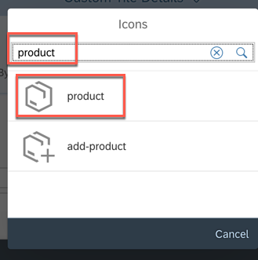

1. You should get the message **Connection to "ErpQueryEndpoint"" established. Response returned: "302: Redirect"**. Click on **Close**  
	

### Check the Neo environemnt
Let's gie a look now to the NEO environment and let's check that everything is in place.

1. Click on this link <https://account.hana.ondemand.com/cockpit> and enter the credentials for the NEO environment provided by your instructor
	

1. Just click on **Confirm** in case you receive this kind of message  
	

1. Click on the **TechEd2018** Global Account  
	

1. Click on the **ASUG** subaccount  
	

1. **[Read and Check Only]** Select **Connectivity -> Destinations** on the left hand side and just make sure that the **ErpQueryEndpoint** destination is correctly in place. Here we have already imported this destination since all the users will share it in the next exercises
	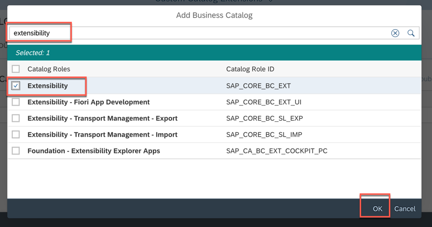

1. Click on **Services**, enter the text "**web**" in the search box, and click on the **SAP Web IDE Full-Stack** tile  
	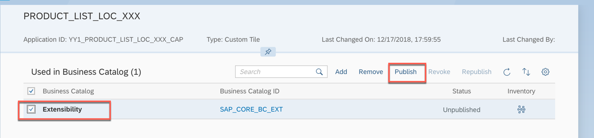

1. Click on **Go to Service**  
	

1. The **SAP Web IDE** tools is launched. Please bookmark this URL becaue it will be used in the next exercises  
	

1. Congratulations! You have successfully completed this exercise.

## Summary
This concludes the exercise. You should have learned how to create a Destination service instance in SAP Cloud Foundry. Please proceed with the [next exercise](../Exercise2/Exercise2.md).
 