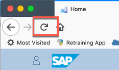
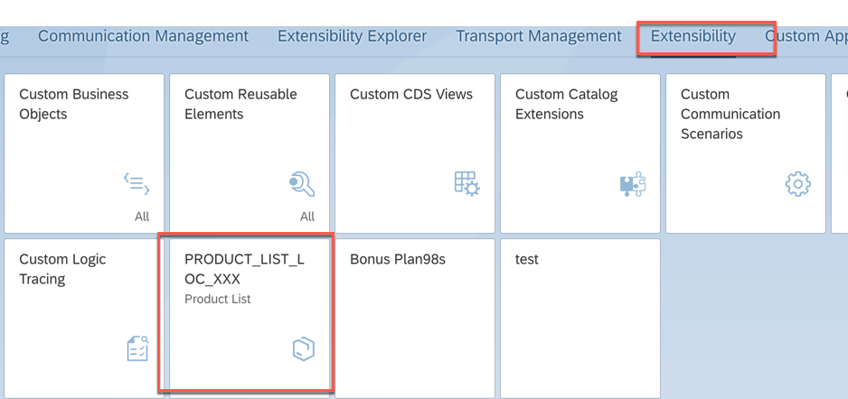
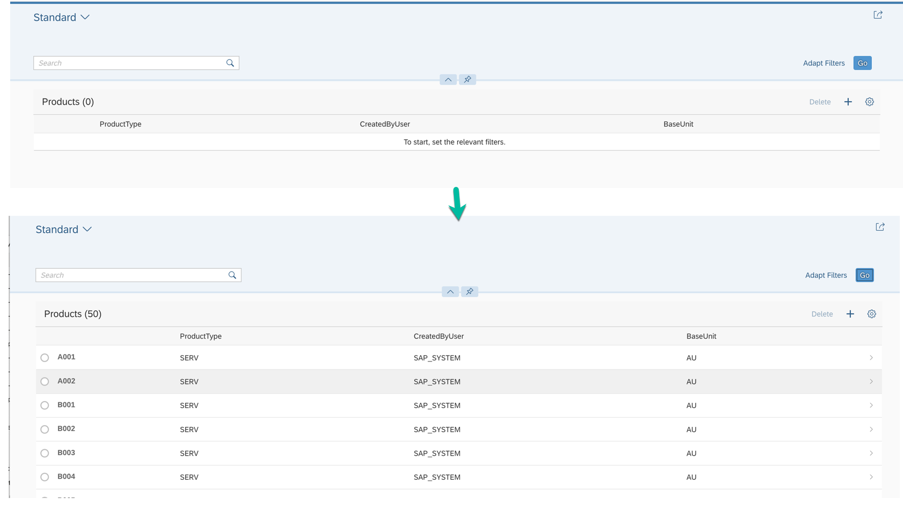

<table width=100% border=>
<tr><td colspan=2></td></tr>
<tr><td colspan=2><h1>EXERCISE 26 - Enable the front-end application in S/4HANA Cloud Launchpad</h1></td></tr>
<tr><td><h3>ASUG PreConference 2018</h3></td><td><h1> &nbsp;20 min</h1></td></tr>
</table>


## Description
In this exercise, you’ll learn how to 

* adapt the application we built in the previous exercise to be ran without the Launchpad
* create a new tile in the S/4HANA Cloud launchpad which launches the application.


## Target group

* Developers
* People interested in learning Application Programming Model 


## Goal

The goal of this exercise is to create a tile in the S/4HANA Cloud Home page to start the application we built in the previous exercise.  

## Prerequisites
  
Here below are prerequisites for this exercise.

* Previous exercises completed


## Steps

1. [Adapt the application we previously built to be ran without the Launchpad](#adapt-application)
1. [Create a new tile in the S/4HANA Cloud launchpad](#create-tile)


### <a name="adapt-application"></a>Adapt the application we previously built to be ran without the Launchpad
What we want to do here is to get rid of the Fiori Launchpad appearing wen we start our Cloud Foundry application we built in the previous exercise, so that it can be run directly. 
	

1. Login to the SAP Web IDE Full-Stack through the link <https://webidecp-ovb9vknezv.dispatcher.hana.ondemand.com/> with the credentials provided by your instructor  
	

1. Right click on the *webapp* folder located under the path *bpr\_bam\_XXX/frontend\_XXX* (where **XXX** is your workstation ID) and select **New -> File**  
	

1. Create a new file named *index.html*  
	

1. Enter the following content in the file
	
	```html
	<!DOCTYPE html>
	<html>
	<head>
		<meta http-equiv="X-UA-Compatible" content="IE=edge" />
		<meta http-equiv="Content-Type" content="text/html;charset=UTF-8"/>
		<meta name="viewport" content="width=device-width, initial-scale=1.0" />
		<title>frontend_XXX</title>
	
		<!-- Bootstrapping UI5 -->
		<script id="sap-ui-bootstrap"
				src="https://sapui5.hana.ondemand.com/resources/sap-ui-core.js"
				data-sap-ui-libs="sap.m, sap.f"
				data-sap-ui-theme="sap_belize"
				data-sap-ui-compatVersion="edge"
				data-sap-ui-preload="async"
				data-sap-ui-resourceroots='{"frontend_XXX": "."}'
				data-sap-ui-frameOptions="trusted">
		</script>
	
		<script>
			sap.ui.getCore().attachInit(function () {
				sap.ui.require([
					"sap/m/Shell",
					"sap/ui/core/ComponentContainer"
				], function (Shell, ComponentContainer) {
					// initialize the UI component
					new Shell({
						app: new ComponentContainer({
							height: "100%",
							name: "frontend_XXX",
							settings: {
								id: "frontend_XXX"
							}
						}),
						appWidthLimited : false
					}).placeAt("content");
				});
			});
		</script>
	
	</head>
	
	<!-- UI Content -->
	<body class="sapUiBody" id="content">
	</body>
	</html>
	```

1. Replace all the occurrences (they should be four) of the string **XXX** with your workstation ID and save the file  
	

1. Double click on the *xs-app.json*, replace the **welcomeFile** string with `/frontend_XXX/index.html` (replacing **XXX** with your workstation ID) and save the file  
	

1. Build the project by right clicking on the project name and choosing **Build -> Build**  
	

1. After a while you should receive a message informing you that the build process is completed  
	

1. Locate the *bpr\_bam\_XXX\_0.0.1.mtar* file in the *mta\_archives* directory, right click on it and do **Deploy -> Deploy to SAP Cloud Platform**  
	

1. Choose the right Cloud Foundry API Endpoint, enter its credentials and click on **Deploy**  
	

1. After some minutes, your deployment should succeed. Click on the **Open** button for your **frontend_XXX** application where **XXX** is your workstation ID  
	

1. Provide your SAP Cloud Foundry credentials if required and click on **Log On**  
	

1. You can see that the application is now started directly without using the Fiori Launchpad. You can click on **Go** to get some data  
	

1.  You get your Business Partners
	

1. Before moving to the next chapter, please write down the application URL you see in the browser: this will be required later  
	


### <a name="create-tile"></a>Create a new tile in the S/4HANA Cloud launchpad
Now that our application can be ran without the Launchpad, let's create a tile for it in the S/4HANA Home page.

1. Logon to the S/4HANA system <https://my300405.s4hana.ondemand.com/> using the credentials provided by your instructor  
	

1. Click on the **Extensibility** tab  
	

1. Click on **Custom Tiles**  
	

1. Click on **New** to create a new tile  
	

1. Enter **ASUG BP XXX** for the Title, where **XXX** must be replaced by your workstation ID, and click **Create**  
	

1. Enter **Business Partners** for the Subtitle and the URL you wrote down in the previous chapter as URL: then click on drop down list to choose an icon  
	

1. Search for "customer" and choose one of the icons proposed: i.e **customer-and-supplier**  
	

1. Check that your tile looks like this and click **Save**  
	

1. Click on **Assign Catalogs** to assign this new tile to a catalog  
	

1. Click on **Add**  
	

1. Search for "extensibility" and choose the **Extensibility - SAP_CORE_BC_EXT** catalog. Click on **OK**  
	

1. Select the **Extensibility** catalog and click **Publish**
	

1. Confirm that you want to publish the catalog  
	

1. The publishing process will take some time  
	

1. At the end, when the catalog is published, go back to the previous page  
	

1. Check that also here the tile is published and go back to the Home page  
	

1. Refresh the browser  
	

1. You should find the new tile in the **Extensibility** catalog. Click on this tile  
	

1. Select the right identity provider  
	

1. The application should open successfully
	

1. Congratulations! You have successfully completed this exercise.


## Summary
This concludes the exercise. You should have learned how to adapt the application we built in the previous exercise to be ran without the Launchpad and how to create a new tile for it in the S/4HANA Cloud launchpad.
Back to the [exercise index page](../../README.md)