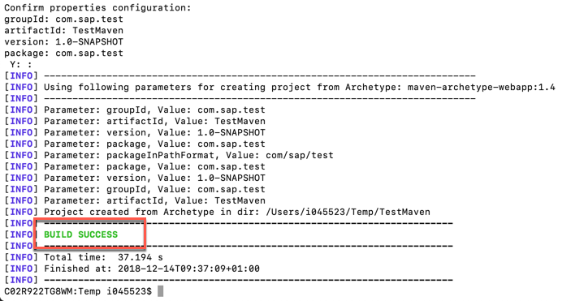
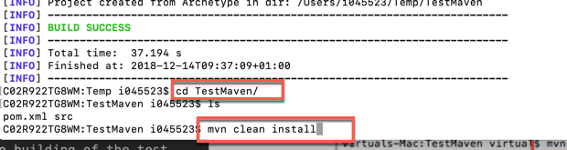
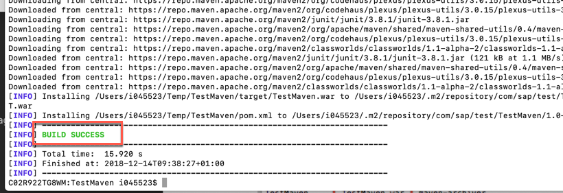
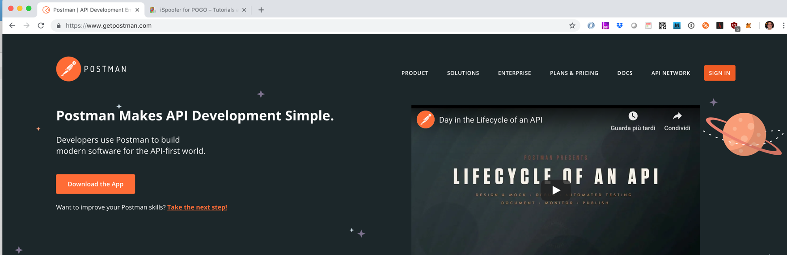
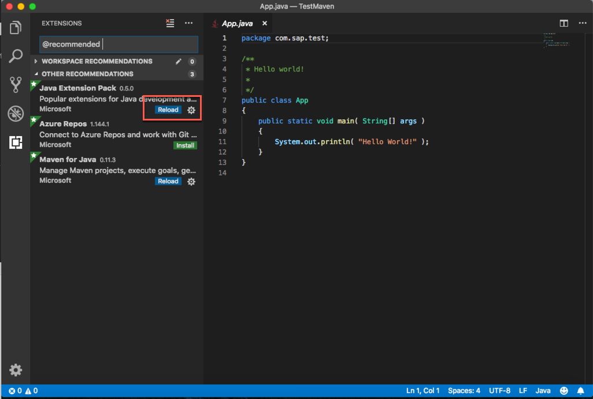
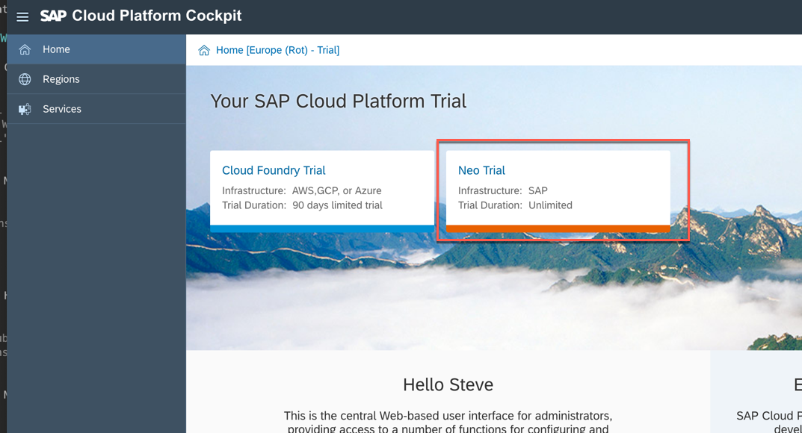
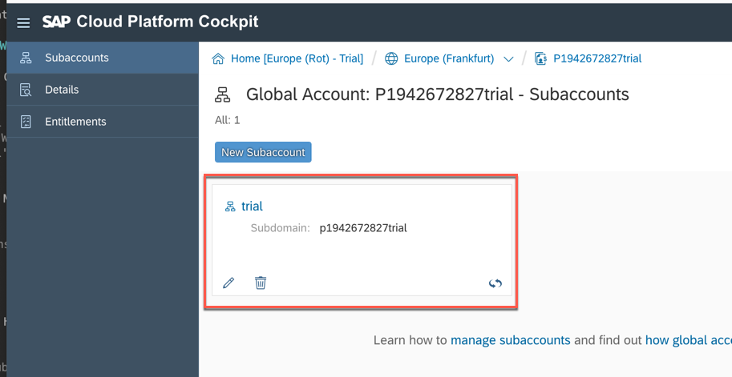

<table width=100% border=>
<tr><td colspan=2><h1>PREREQUISITES</h1></td></tr>
<tr><td><h3>SAP Partner Workshop</h3></td><td><h1> &nbsp;60 min</h1></td></tr>
</table>


## Description
In this exercise, you’ll go through the basic steps of setting up the development environment required for S/4HANA Cloud extension & SAP Leonardo workshop.


## Target group

* Application Developers
* People interested in learning about 
	- S/4HANA Cloud extension and SDK
	- SAP Leonardo Internet of Things Foundation
	- SAP Leonardo Machine Learning Foundation 


## Goal

The goal of this pre-requisite exercise is to have your workstation or laptop well prepared in order to attend to the *"Build innovative extension of S/4HANA Cloud with SAP Cloud Platform and SAP Leonardo Technologies Power Week"*.


## Prerequisites
  
Here below are prerequisites required for the exercises in this workshop.

1. [Bring Your Own Laptop with Admin Access](#laptop)
1. [Install Eclipse Oxygen](#install-eclipse-oxygen)
1. [Install SAP Cloud Platform Eclipse Oxygen Plugins](#install-cp-oxygen-plugin)
1. [Install Java JDK](#install-java-jdk)
1. [Install Chrome Postman application](#postman)
1. [Install Chrome Postman Interceptor application](#postman-interceptor)  
1. [Install NodeJS](#install-nodejs)
1. [Configure Eclipse Oxygen Java preference](#configure-eclipse-java)
1. [Install SAP Cloud Platform SDK](#install-cp-sdk)
1. [Create a new Neo Runtime Environment](#create-runtime-environment)
1. [Sign up for SAP Cloud Platform Neo trial account](#sign-up-neo)
1. [Sign up for SAP Cloud Platform Cloud Foundry trial account](#sign-up-cf)
1. [Install Cloud Foundry CLI](#install-cf-cli)
1. [Install ML Foundation CLI](#install-ml-cli)
1. [Install Apache Maven for Windows/Mac](#install-maven)
1. [Check if Eclipse/Maven is installed and Java set-up is done correctly](#check-eclipse-maven)
1. [Install Eclipse YML plugin](#eclipse-yml-plugin)
1. [Remote Desktop Connection](#rdc)


### <a name="laptop"></a> Bring Your Own Laptop with Admin Access
 
Please bring the laptop that you have admin access for hands-on exercises.  You will need the admin right to setup the development environment for the exercises by installing or updating the software or configuring the setup.


### <a name="install-eclipse-oxygen"></a>Install Eclipse Oxygen
Eclipse Oxygen IDE is required for Java application development during the workshop. You will create a SAP S/4HANA Cloud SDK project for Cloud Foundry from an archetype using the Eclipse IDE. 

1.	Download and install **Eclipse Oxygen IDE for Java EE Developers**

	#### For Windows:
	<http://www.eclipse.org/downloads/download.php?file=/technology/epp/downloads/release/oxygen/3a/eclipse-jee-oxygen-3a-win32-x86_64.zip>  
	

	#### For Mac:
	<http://www.eclipse.org/downloads/download.php?file=/technology/epp/downloads/release/oxygen/3a/eclipse-jee-oxygen-3a-macosx-cocoa-x86_64.dmg>  
	


### <a name="install-cp-oxygen-plugin"></a>Install SAP Cloud Platform Eclipse Oxygen Plugins
Now that you have installed Eclipse, you need to install the SAP Cloud Platform tools for Java. This is done following the standard approach of Eclipse to install plugins.

1.	Open **Eclipse Oxygen**
1. Click on **Help -> Install New Software…**  
	
1. Enter this link <https://tools.hana.ondemand.com/oxygen/> and hit **ENTER**; if requested, type a description for this repository and click **OK**  
	
1. Select **SAP Cloud Platform Tools** and click **Next**   
	
1. Click **Next**  
	
1. Accept the license agreement and click **Finish**  
	
1. Select **Install anyway**  
	
1. Click **Restart Now** to restart Eclipse  
	


### <a name="install-java-jdk"></a>Install Java JDK
Eclipse IDE needs Java JDK. JDK (Java Development Kit) includes the JVM, standard class libraries, and several other tools that a developer needs in order to compile and run the Java program.


1.	Download and install Java JDK from this link <http://www.oracle.com/technetwork/java/javase/downloads/jdk8-downloads-2133151.html>  
	


### <a name="postman"></a> Install Chrome Postman application
For the workshop exercises you need to install the **Postman** application for Chrome. It will allow you to send REST requests to backend systems. Please pay attention that, this kind of application has been deprecated and removed from the Chrome web store, because it has been converted to a stand-alone application. However, for the scope of these exercises you will need to install it as a Chrome app. You can open the following link to install it:

<https://chrome.google.com/webstore/detail/postman/fhbjgbiflinjbdggehcddcbncdddomop>  
	


### <a name="postman-interceptor"></a> Install Chrome Postman Interceptor application
Another required tool is the Postman Interceptor app for Chrome. This can be found on the Chrome Web Store. Postman Interceptor helps you send requests which use browser cookies through the Postman app. It can also send headers which are normally restricted by Chrome but are critical for testing APIs. The Interceptor makes this process painless.

1. Navigate to <https://chrome.google.com/webstore/search/postman%20interceptor> and select the **Postman Interceptor** tool  
	

1. Click **Add to Chrome**  
	


### <a name="install-nodejs"></a>Install NodeJS
NodeJS is needed in the exercise to secure Cloud Foundry application using the SAP Approuter component. Protect your Java microservice so that it only accepts requests based on a valid JSON Web Token (JWT), received from the Approuter. This will also install the NodeJS Package Manager (npm). 

1. Close any Terminal window on your machine

1. Download the latest **LTS** version of NodeJS from from [here](https://www.nodejs.org)
	

1. Install it according to your operating system


### <a name="configure-eclipse-java"></a>Configure Eclipse Oxygen Java preference
Make sure Eclipse IDE uses right JREs.

1.	Click on **Window -> Preferences**. This should open the Preferences window. If you are on MAC you can find Preferences item under the Eclipse menu  
	
1. Search for **Installed JREs**
	

> NOTE: Make sure that the location is pointing your Java JDK 1.8 instead of your Java JRE



### <a name="install-cp-sdk"></a>Install SAP Cloud Platform Neo Environment SDK
Neo commands used during S/4HANA extension development are part of SAP Cloud Platform SDK.

1. Download the latest version of Java Web Tomcat 8 Neo Environment SDK from here <https://tools.hana.ondemand.com/#cloud>
	
	
1. Extract it in a folder on your disk

1. You will need this SDK in the Exercise 14 where you are going to start a Java Web Tomcat 8 server.


### <a name="create-runtime-environment"></a>Create a new Neo Runtime Environment
During Java application deployment to SAP Cloud Platform, you will be using Java EE 7 Web Server runtime.

1. Download the latest version of Java EE 7 Web Profile TomEE 7 from here <https://tools.hana.ondemand.com/#cloud>  
	

1. Extract it in a folder on your disk

1.	From Eclipse Oxygen, go to **Preferences** window. Search for **runtime** and, under the path **Server -> Runtime Environments** click **Add**  
	

1.	Under **SAP** catalog, select **Java EE 7 Web Profile TomEE 7** and click **Next**  
	

1.	Browse to the location of the Java EE 7 Web Profile TomEE 7 folder you have just extracted and click **Finish**  
	

1.	Java EE 7 Web Profile is installed. Click on **Apply and Close**    
	


 
### <a name="sign-up-neo"></a>Sign up for SAP Cloud Platform Neo trial account
You need Neo trial SAP Cloud Platform to complete standalone hands-on exercise for Workflow Service and Business Rules Service. 

1.	Sign up for SAP Cloud Platform trial account from <https://account.hanatrial.ondemand.com/> by clicking on the **Register** button. If you already have an account on the Trial landscape please login with that account
	

1. After you have logged in, click on **Neo Trial**  
	

1. This will take you to the **Overview** page of the SAP Cloud Platform Cockpit for the Neo stack
	

1.	From SAP Cloud Platform Cockpit, click on **Services**. Enable the Portal service	
	 
	> **NOTE**: Portal service must be enabled first.

1.	At the same way enable these further services
	- SAP Web IDE Full-Stack
	- Workflow
	- Business Rules
	
	
        

### <a name="sign-up-cf"></a>Sign up for SAP Cloud Platform Cloud Foundry trial account
Sign up also for SAP Cloud Platform Cloud Foundry trial account.

1.	From SAP Cloud Platform Cockpit, click on **Cloud Foundry Trial**. This will bring you directly into your Cloud Foundry Trial subaccount. 
	

2. If you already have activated this kind of landscape in the past, consider that it might be expired since the validity is only **30 days**. All you have to do is to reactivate the trial by going on the first icon in the top toolbar and selecting **Extend Free Trial**. Then you have to refresh your browser. The button for extending free trial is only available after your trial plan is expired
	

1.	Select your trial sub-account
		 

1.	You should have just one space. Click on it
		 

1.	Make sure you have **2GB Memory** for your space. If you don’t have 2GB Memory, please register a new account.
	


### <a name="install-cf-cli"></a>Install Cloud Foundry CLI
Cloud Foundry CLI is the official command line client for Cloud Foundry. It provides a set of commands for managing your apps.  

1.	Cloud Foundry CLI can be downloaded here <https://github.com/cloudfoundry/cli#downloads>. Just select the installer which matches your Workstation's Operating System
	

1. Once downloaded the file, please install it by double clicking on the downloaded file.


### <a name="install-ml-cli"></a>Install Machine Learning Foundation CLI
SAP Leonardo Machine Learning foundation Command Line Interface (CLI) is a way of interacting with the foundation and using its services, e.g. to simplify data upload for Retraining and Bring your Own Model scenarios as described in the official documentation.

1.	Machine Learning Foundation CLI can be downloaded here <https://tools.hana.ondemand.com/#mlfoundation>. Just select the installer which matches your Workstation's Operating System
	

1. Once downloaded the file, please install it following the instruction contained in the same page


### <a name="install-maven"></a>Install Apache Maven for Windows/Mac
SAP offers a Maven plugin to support Java developers in using Maven to develop SAP Cloud Platform applications. You need Maven tool installed on you workstation. Here are the steps to install Maven.

#### WINDOWS

1.	Install Chocolatey (a package manager for Windows)

```sh	
@powershell -NoProfile -ExecutionPolicy Bypass -Command "iex ((New-Object System.Net.WebClient).DownloadString('https://chocolatey.org/install.ps1'))" && SET "PATH=%PATH%;%ALLUSERSPROFILE%\chocolatey\bin"
```

2.	Install Maven

```sh
	choco install maven
```

#### MAC

1.	Install HomeBrew (a package manager for Mac)

```sh	
/usr/bin/ruby -e "$(curl -fsSL https://raw.githubusercontent.com/Homebrew/install/master/install)"
```

2.	Install Maven

```sh
	brew update
	brew install maven
```


### <a name="check-eclipse-maven"></a>Check if Eclipse/Maven is installed and Java set-up is done correctly
Building successfully a Maven-based Java project in your Eclipse is a prerequisite.
You are ready to test if you can build and run a Java Web application project with Maven in your Eclipse IDE.


1. Be sure you have already created and set up a new Neo Runtime Environment as explained earlier

1. Open Eclipse

1. Click on **File -> New -> Project...**  
	

1. Choose **Maven -> Maven Project** and click **Next**  
	

1. Click **Next**  
	

1. Select the **Internal** catalog, choose the **maven-archetype-webapp** and click **Next**  
	

1. Enter
 
	| Parameter    | Value        |
	| ------------ | --------     |
	| Group ID     | com.sap.test |
	| Artifact ID  | TestMaven    |
	
	and click **Finish**
	 
	

1. The project is created. Right click on the project name and choose **Properties**  
	

1. Select **Project Facets**, change the Java version to **1.8**, click on the **Runtimes** tab on the right-hand side, select the **Java EE 7 Web Profile TomEE 7** runtime and click on **Apply and Close**  
	

1. Now, if there were errors in the project, they should be gone. Right click on the *pom.xml* file and choose **Run As -> Maven build**  
	

1. Enter the goals **clean install** if required and click **Run**  
	

1. The Eclipse IDE will open a Console Tab that displays the build progress. You should see **BUILD SUCCESS**. If your build was not successful, please check the troubleshooting guide for Maven  
	

1. Right click on the project name and choose **Refresh**  
	

1. In Project Explorer view expand the project node **TestMaven -> target** to find the built *TestMaven.war* file  
	
	
	
1.  Maven has build successfully the *TestMaven* Java web application and created a *TestMaven.war* file (see console output for the location).


### <a name="eclipse-yml-plugin"></a>Install Eclipse YML plugin
It's important for the exercises to install an Eclipse plugin which allows us to easily manage **YAML** files. 

1. Open Eclipse IDE and click on **Help -> Eclipse Marketplace...**  
	

1. Enter the text "**yml**" in the search box and install the **YEdit** plugin  
	

1. Accept the license agreement and click **Finish**  
	

1. Click **Install anyway**  
	

1. Restart Eclipse  
	


### <a name="rdc"></a> Remote Desktop Connection
 
In order to connect with the Virtual Machines, we have prepared for you, you need to have the Remote Desktop Connection (RDC) tool installed on your machine. For Windows users, RDC comes already installed, so if you have Windows you don't have to worry about it. If you are MAC user, instead, you can download it for free from the Mac App Store.  
	


## Summary
You have successfully completed the prerequisites installation.
