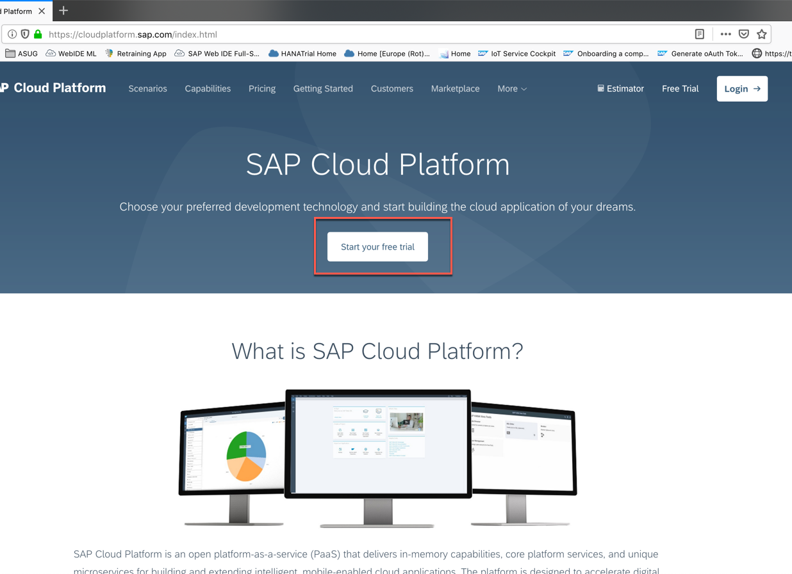
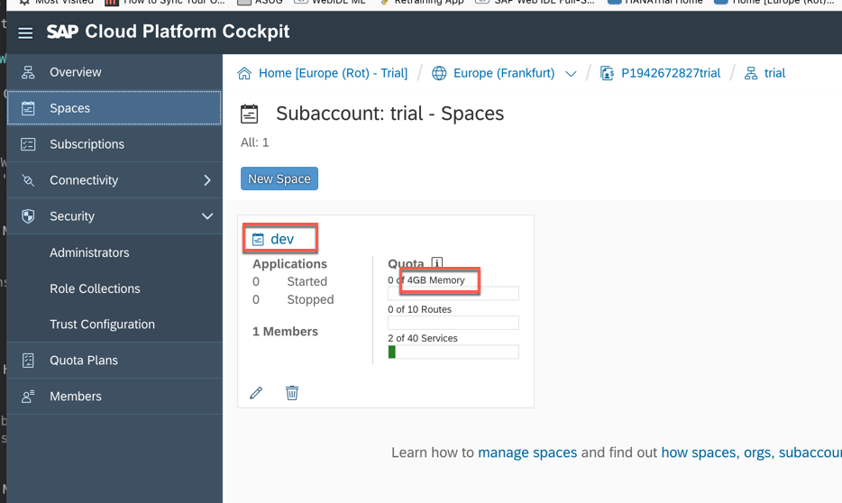

<table width=100% border=>
<tr><td colspan=2></td></tr>
<tr><td colspan=2><h1>PREREQUISITES</h1></td></tr>
<tr><td><h3>SAP S/4HANA Cloud Bootcamp</h3></td><td><h1> &nbsp;30 min</h1></td></tr>
</table>


## Description
In this exercise, you’ll go through the basic steps of setting up the development environment required for S/4HANA Cloud extension.


## Target group

* Application Developers
* People interested in learning about 
	- S/4HANA Cloud extension and SDK


## Goal

The goal of this pre-requisite exercise is to have your workstation or laptop well prepared in order to attend to the bootcamp.


## Prerequisites
  
Here below are prerequisites required for the exercises in this workshop.

1. [Bring Your Own Laptop with Admin Access](#laptop)
1. [Install Java JDK](#install-java-jdk)
1. [Install Apache Maven for Windows/Mac](#install-maven)
1. [Check if Maven is installed and Java set-up is done correctly](#check-maven)
1. [Install Postman application](#postman)
1. [Install Visual Studio Code](#install-vscode)
1. [Sign up for SAP Cloud Platform Neo trial account](#sign-up-neo)
1. [Sign up for SAP Cloud Platform Cloud Foundry trial account](#sign-up-cf)


### <a name="laptop"></a> Bring Your Own Laptop with Admin Access
 
Please bring the laptop that you have admin access for hands-on exercises. You will need the admin right to setup the development environment for the exercises by installing or updating the software or configuring the setup.


### <a name="install-java-jdk"></a>Install Java JDK
Eclipse IDE needs Java JDK. JDK (Java Development Kit) includes the JVM, standard class libraries, and several other tools that a developer needs in order to compile and run the Java program.


1.	Download and install Java JDK from this link <http://www.oracle.com/technetwork/java/javase/downloads/jdk8-downloads-2133151.html>  
	


### <a name="install-maven"></a>Install Apache Maven for Windows/Mac
SAP offers a Maven plugin to support Java developers in using Maven to develop SAP Cloud Platform applications. You need Maven tool installed on you workstation. Here are the steps to install Maven.

#### WINDOWS

1.	Install Chocolatey (a package manager for Windows)

```sh	
@powershell -NoProfile -ExecutionPolicy Bypass -Command "iex ((New-Object System.Net.WebClient).DownloadString('https://chocolatey.org/install.ps1'))" && SET "PATH=%PATH%;%ALLUSERSPROFILE%\chocolatey\bin"
```

2.	Install Maven

```sh
	choco install maven
```

#### MAC

1.	Install HomeBrew (a package manager for Mac)

```sh	
/usr/bin/ruby -e "$(curl -fsSL https://raw.githubusercontent.com/Homebrew/install/master/install)"
```

2.	Install Maven

```sh
	brew update
	brew install maven
```


### <a name="check-maven"></a>Check if Maven is installed and Java set-up is done correctly
You are ready to test if you can build and run a Java Web application project with Maven.


1. Open a Terminal window on your laptop

1. Create a new folder where a new Maven project is going to be created

1. Go inside this folder in the Terminal and run the following command

	```sh
	mvn archetype:generate -DarchetypeGroupId=org.apache.maven.archetypes -DarchetypeArtifactId=maven-archetype-webapp -DarchetypeVersion=1.4
	```
	

1. The process starts downloading all the needed artifacts. 
	

1. After a while you will be requested to enter the Group ID and the Artifact ID for your app. Enter
 
	| Parameter    | Value        |
	| ------------ | --------     |
	| Group ID     | com.sap.test |
	| Artifact ID  | TestMaven    |
	
	and hit enter to any other prompt confirming the proposed values  

	

1. At the end of the process you should see the **BUILD SUCCESS** message as shown in the picture. 

	

1. Go inside the *TestMaven* folder and run the command

	```
	mvn clean install
	```
	This command will trigger the cleaning of the *target* folder and the building of the test application  
	

1. When the process finishes you should have again a **BUILD SUCCESS** message: this means that this sample application has been built successfully  
	

1. You can also check that the application named *TestMaven.war* is correctly available in the target folder  
	


### <a name="postman"></a>Install Postman application
For the workshop exercises you need to install the **Postman** application. It will allow you to send REST requests to backend systems. You can open the following link to install it:

1. Download Postman from [here](https://www.getpostman.com) and install it  
	


### <a name="install-vscode"></a>Install Visual Studio Code
For the workshop exercises you need to install the **Visual Studio Code** as your development environment. You can open the following link to install it:

1. Download Visual Studio Code from [here](https://code.visualstudio.com) and install it  
	

1. Click on **Open folder...**  
	

1. Browse for the folder of the **TestMaven** project you created earlier using Maven  
	

1. Locate the *App.java* in the Explorer and if you get the propt to install the Java extension, install it
	

1. After the installation of the Java Extension Pack and the Maven for Java extensions, click on one of the **Reload** buttons to reload your IDE
	

1. After it's reloaded simply close the current folder from the **File** menu
	

1. Your Visual Studio Code is correctly installed and you have also equipped it with the Java Extension pack.


 
### <a name="sign-up-neo"></a>Sign up for SAP Cloud Platform Neo trial account
You need Neo trial SAP Cloud Platform to complete standalone hands-on exercise for Workflow Service and Business Rules Service. 

1.	Sign up for SAP Cloud Platform trial account from <https://cloudplatform.sap.com/> by clicking on the **Start your free trial** button. If you already have an account on the Trial landscape please login with that account  
	

1. After you have logged in, click on **Neo Trial**   
	

1. This will take you to the **Overview** page of the SAP Cloud Platform Cockpit for the Neo stack  
	

1.	From SAP Cloud Platform Cockpit, click on **Services**, search for the word "web" and enable the **SAP Web IDE Full-Stack** service  	
	 	
        


### <a name="sign-up-cf"></a>Sign up for SAP Cloud Platform Cloud Foundry trial account
Sign up also for SAP Cloud Platform Cloud Foundry trial account.

1.	From SAP Cloud Platform Cockpit, click on **Cloud Foundry Trial**. This will bring you directly into your Cloud Foundry Trial subaccount  
	

2. If you already have activated this kind of landscape in the past, consider that it might be expired since the validity is only **30 days**. All you have to do is to reactivate the trial by going on the first icon in the top toolbar and selecting **Extend Free Trial**. Then you have to refresh your browser. The button for extending free trial is only available after your trial plan is expired  
	

1.	Select your trial sub-account  
		 

1.	Click on **Spaces** on the left sidebar  
		 

1.	You should have just one space. Make sure you have **4GB Memory** for your space. If you don’t have 4GB Memory, please register a new account.  
	


## Summary
You have successfully completed the prerequisites installation.
